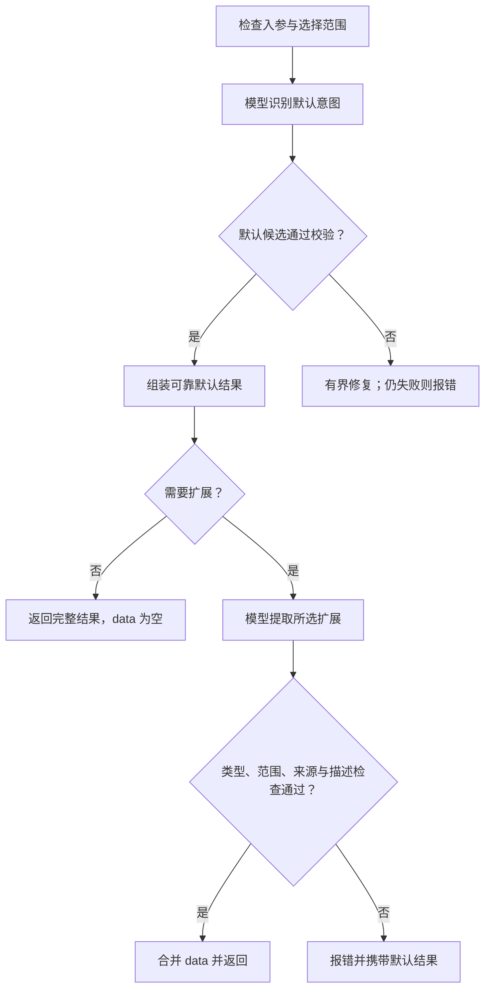

# intent-runtime 技术方案（V1）

- 日期：2026-10-09
- 状态：技术设计稿，供确认；本稿没有表示模块已经实现或真实模型测试已经通过。
- 需求依据：《intent-runtime-需求概况-v1.md》已确认稿，保留附录 A—F、81 组语义场景和默认语言 `en`。
- 本次修订：对象式 parse 请求；标准 BCP 47 标签及非法配置报错；V1 宿主改为 Codex 客户端，移除 CLI 独立回合要求；同步工程和验收。
- 本稿中的 `Intent`、执行器工厂及宿主桥接工具是拟实现的模块接口，不是已经发布的包。外部模型 API、客户端 MCP 配置和语言标准已对照官方资料核实。
- 旧版 Profile、自由 action、执行关系图、重复 id/version 等设计不纳入本稿。

## 1. 设计结论与本轮范围

本项目是独立的 TypeScript / Node.js 意图结构化模块。默认意图识别、原生 `schema-dsl` 扩展提取、校验、响应组装属于同一核心；模型 API 和宿主协作位于不同驱动入口。

**最新约定优先于旧稿：公开调用改为 `await intent.parse({ input, fields, context })`；结构化语言默认 `en`，显式配置须为标准 BCP 47 语言标签；V1 宿主验证对象是 Codex 客户端，不要求 Codex CLI 独立回合。**

| 接入方式 | 实际识别者 | 谁驱动 | V1 范围 |
|---|---|---|---|
| 模型 API | 配置的 OpenAI 或 xAI/Grok 模型 | `parse(request)` 通过 API 执行器主动请求 | 实际 API 请求、两阶段生成、失败处理 |
| Codex 客户端 | 客户端当前任务中的 Codex 模型 | 客户端调用本地 MCP 工具，prepare / accept 推进 | 客户端配置、明确触发、当前模型协作及最终结果验证 |
| 其他宿主 | Claude、Grok 等宿主实际提供的模型 | 后续宿主的工具协作或正式生成入口 | 核心边界预留；V1 不实现或宣称兼容 |
| Codex 独立回合 | CLI / SDK / app-server 创建的独立回合 | 后续可增加的执行器 | 不属于 V1 必需交付或验收 |

本稿按用户所说的“Codex 客户端”指官方桌面客户端中的当前任务使用场景。实施时记录实际客户端名称、版本、操作系统及本地执行方式；当前官方说明中的桌面入口名称可能随版本变化。托管网页不能直接等同于本地客户端。

xAI/Grok **模型 API**与 Grok **宿主**是不同维度。V1 只用 Codex 验证宿主能力，不删除已要求的模型 API 能力；其他宿主和 Codex 独立回合都留到后续版本。

### 1.1 API 模式的一次 `parse()` 过程

以 `parse({ input, fields: ["orderId"], context })` 为例：

1. 检查请求对象，保留 input 原文，检查字段选择和显式上下文，创建本次不可变任务。
2. 核心生成默认意图识别任务，API 执行器完成一次真实模型生成。
3. 核心解析并校验候选，形成主要意图、多意图、要求、禁止事项和状态。
4. 因为选择了 `orderId`，核心生成扩展提取任务，再请求一次模型。
5. 检查扩展的范围、类型、来源及描述要求，合并 `data`，返回完整结果。

没有扩展定义或传 `fields: []` 时，仅完成默认阶段，返回全部默认字段和 `data: {}`。不是返回空对象。

### 1.2 Codex 客户端模式的过程

客户端调用 `intent_prepare` → 工具返回任务并结束 → 客户端当前模型生成候选 → 客户端调用 `intent_accept` → 核心校验后返回下一任务或最终结果。需要扩展时，再完成一轮生成和提交。

客户端启动的是本模块的本地 MCP 服务，用来准备任务与校验结果；它不需要启动 `codex exec` 来创建另一个识别会话，也不需要为这条宿主路径另配模型 API Key。

普通 Node.js 函数没有自动访问客户端当前模型的能力。API 路径使用对象式 parse；客户端当前模型使用工具协作驱动同一核心。不能在没有 executor 的情况下伪造一个可以自行调用当前模型的 parse 实现。两条路径的输入语义、字段选择规则和最终 IntentResult 一致。

### 1.3 新项目与维护原则

V1 使用单仓库、单 npm 包、多个明确导出入口。核心不绑定 Codex；Codex 客户端的配置样例和触发流程放在独立集成目录，MCP 与 bridge 保持通用，不制造一个没有真实生成入口的 `createCodexExecutor`。

项目结构、依赖方向、导出、构建和发布见第 20 节；开发闭环与评审结论见第 22—23 节。

## 2. 已确认约定与新增实现配置

### 2.1 对象式调用

```ts
const intent = new Intent(config);

await intent.parse({ input });
await intent.parse({ input, fields: ["orderId"] });
await intent.parse({ input, fields: [] });
await intent.parse({ input, fields: ["orderId"], context });
await intent.parse({ input, context });
```

```ts
interface IntentParseRequest {
  input: string;
  fields?: readonly string[];
  context?: IntentContext;
}

parse(request: IntentParseRequest): Promise<IntentResult>;
```

`input`、`fields`、`context` 属于一次识别任务，放在同一个对象中可以按名称理解，也便于省略其中任一可选项。目标 V1 已按本方案实现为开发预览，尚未正式验收或发布；既有原型不约束本次实现，V1 只提供这一签名，不额外维护旧位置参数重载。实例级 language、schema 和 executor 继续放在构造配置中。

| 内容 | 实现约定 |
|---|---|
| `input` | 必填字符串；输出中原样保留 |
| `fields` 省略或 `undefined` | 尝试提取全部已定义顶层扩展字段 |
| `fields` 为名称数组 | 只提取这些顶层字段；重复名称去重 |
| `fields` 为 `[]` | 返回完整默认意图，`data: {}`；不进行扩展模型调用 |
| `context` | 请求对象中的可选属性；仅使用调用方明确提供的相关材料 |
| language 省略或 `undefined` | 使用 `en` |
| 配置语言 | 合法、登记有效的 BCP 47 标签；不是任意语言名称，详见第 18 节 |
| schema 省略或空对象 Schema | 保留完整默认能力，没有业务扩展 |
| 未知字段名称 | 入参错误，不自动当作新字段 |
| 嵌套路径 | V1 不支持 `customer.name` 等子路径选择；选择顶层对象或列表时整体提取 |

请求必须是普通对象；缺失 input、传 null / 数组 / 字符串或传入旧式多参数调用，均在模型调用前反馈 INPUT_INVALID。请求对象只接受 input、fields、context；未知属性明确报错，避免 `field`、`inputt` 等拼写错误被静默忽略。省略 context 与显式 undefined 等价，null 不表示“没有上下文”。

### 2.2 配置定义

```ts
import type { JSONSchema } from "schema-dsl/pure";

// TypeScript string 不能证明标准标签有效，构造时必须做运行时校验。
type StructuredLanguage = string;

interface IntentConfig {
  language?: StructuredLanguage;
  schema?: JSONSchema;
  executor?: ModelExecutor;
  timeoutMs?: number;         // parse 整次调用的总时限，默认 120_000
  repairAttempts?: 0 | 1;    // 每阶段的格式/结构修复次数，默认 1
  limits?: Partial<IntentLimits>;
}
```

`language` 与 `schema` 是已确认的使用配置。`executor`、超时、修复次数和资源上限是本方案增加的运行配置，不改变业务响应含义。

构造器可以不配置执行器，供纯 Schema 检查和 Codex 客户端协作入口使用。直接调用 `parse(request)` 时必须存在可调用执行器，否则抛出 EXECUTOR_NOT_CONFIGURED；不扫描 API Key、不猜测宿主、不自动启动 Codex CLI 或其他模型。

模型名称、认证信息、服务地址和供应商专有参数由执行器管理，不在 IntentConfig 中重复设置。

input 检查使用 `input.trim()` 判断是否只有空白，但不把 trim 后的值作为解析原文。fields 必须是字符串数组，不接受字符串、null、非字符串成员或位置式字段编号。名称按字面匹配已定义顶层键，不按点号拆路径；如果 Schema 真正定义了带点号的顶层名称，仍按该完整名称选择。

schema 接受原生 `s({...})` 生成的对象定义，不接收待执行的 DSL 代码字符串。省略 Schema、`s({})` 或显式空定义都表示没有扩展；非空定义必须是有 properties 的对象 Schema。非法定义在构造时反馈。

语言非法在构造时反馈 CONFIG_INVALID，不等到识别后才判断，也不能静默回退 en。仅未配置时使用默认值。

### 2.3 配置快照

构造时完成以下工作：

1. 校验标准语言标签，保存规范化语言值并检查运行配置。
2. 检查 Schema 支持范围，建立不可变快照。
3. 保存完整字段名称集合和完整字段语义说明。
4. 创建实例级校验器和有限容量的 Schema 投影缓存。
5. 不调用模型，不读取业务资料，不加载会话历史。

每次 parse 或 prepare 都对同一请求语义做检查并建立本次快照。解析期间不修改调用方 Schema、请求对象、输入或上下文；调用方随后修改原 Schema，不影响已创建实例；需要新定义时创建新实例。

## 3. 接入范围、宿主扩展与运行方式

### 3.1 V1 使用环境

| 环境 | 入口 | 前置条件 | 本模块执行什么 |
|---|---|---|---|
| 普通应用、服务或客户端中的 Node.js 进程 | API 执行器 + `parse(request)` | 供应商、模型名、API Key、网络 | 请求模型 API，等待候选并校验 |
| Codex 桌面客户端当前任务 | 本地 MCP + prepare / accept | 可用的本地 MCP 连接、实例配置及明确触发指令 | 准备任务、接收当前模型候选、推进阶段 |
| 后续其他宿主 | 通用 bridge 或新增执行器 | 真实可用的宿主入口、独立验证 | 后续版本实现，不列入 V1 验收 |

API 认证与客户端认证分别由正式入口管理。模块不扫描登录文件、不转换宿主令牌，不根据当前进程猜测接入方式。

“API 方式”指主动调用模型 API；V1 不另建对外 HTTP 业务服务。上层可包装 parse，但该包装不是模型调用本身。

### 3.2 两种驱动方式共用一个核心

- API：parse 等待执行器生成，自动驱动 core、data 和有界修复。
- Codex 客户端：prepare / accept 每次先结束工具调用，把生成控制权交还客户端当前模型。
- 两者使用相同请求语义、阶段任务、候选检查、状态计算、数据校验及最终响应。

客户端协作不是一个主动生成的 ModelExecutor。只有宿主提供了真实、可调用的生成接口时，后续才可实现该执行器；不能用 MCP 工具注册冒充模型调用函数。

### 3.3 V1 与后续版本

| 类别 | V1 必需 | 后续能力 |
|---|---|---|
| 核心 | 对象式请求、完整默认字段、全部/部分/空字段选择、显式上下文、两阶段及失败结果 | 不在本次增加业务字段 |
| 语言 | 未配置 en；显式配置须为标准 BCP 47 标签；非法报错 | 更新标准登记数据和评测材料，不建立语种白名单 |
| 模型 API | OpenAI / xAI 实际请求、真实生成和失败处理 | 增加供应商适配器 |
| 宿主 | Codex 客户端本地工具协作及实际验证 | Claude、Grok 等宿主；按实际入口增加集成 |
| 独立回合 | 不作为 V1 必需能力 | Codex CLI / SDK / app-server 等正式入口 |
| 工程 | 单包结构、稳定导出、测试评测、构建及包安装验证 | 有独立依赖与发布需求后再拆包 |

其他客户端即使采用相同 MCP 协议，也不等于已经完成兼容验收。新增宿主要补充配置、触发流程、合同检查、真实联调和版本记录；核心意图规则保持一致。

### 3.4 MCP 的作用和边界

MCP 让客户端访问模块工具，本身不是模型 API。当前模型正在等待工具结束时，工具不能再等待同一个模型继续生成，否则流程无法推进。

V1 使用普通 prepare / accept 工具协作，不把反向模型采样作为必需能力。客户端连接解决工具可访问，集成指令或上层流程解决何时调用；两者都要落实。

启动本模块 MCP 服务所用的 Node 程序和命令入口不等于 Codex CLI 识别模式。V1 不要求安装或调用 `codex exec`，也不承诺自动拦截客户端所有用户消息。

## 4. 核心职责划分

| 部件 | 负责 | 实际产物 |
|---|---|---|
| 入参与上下文规范化 | 检查类型、限制和角色；原文保持不变 | 本次不可变解析任务 |
| Schema 处理 | 检查原生定义、创建顶层投影、保留描述 | 配置快照与所选校验定义 |
| Prompt 构建 | 固定识别规则、区分材料来源、配置结构化语言 | instructions + payload |
| 解析流程 | 驱动 core/data 两阶段、修复、时限 | 阶段状态 |
| 默认结果校验与组装 | 约束检查、状态归类、生成响应内 id | 默认结果 |
| 扩展校验 | 原生类型与约束、选中范围、来源和描述检查 | data 或具体问题 |
| 执行器 | 调用一个真实模型入口、转换完成/拒绝/失败信息 | 模型候选文本 |
| 宿主桥接 | 保管本次临时状态，prepare / accept / cancel | 任务、结果或错误 |

不增加业务执行器、工具选择器、权限判断器、长期记忆或工作流引擎。`ModelExecutor` 中的“执行”只指执行模型请求。

## 5. 统一模型执行器合同

### 5.1 请求与返回

```ts
type JsonValue =
  | null | string | number | boolean
  | JsonValue[] | { [key: string]: JsonValue };

interface ModelRequest {
  stage: "core" | "data";
  instructions: string;
  payload: string;                // 核心已经序列化的材料
  format:
    | { kind: "json_schema"; name: string; schema: JSONSchema }
    | { kind: "json_object" };
  signal: AbortSignal;
}

type ModelReply =
  | { outcome: "complete"; text: string }
  | { outcome: "refusal" | "incomplete"; detail?: string };

interface ModelExecutor {
  readonly id: string;
  readonly capabilities: ExecutorCapabilities;
  generate(request: ModelRequest): Promise<ModelReply>;
}
```

网络、认证、进程退出等异常由执行器抛出，核心统一转换为模块错误。`outcome` 与意图的 `status` 完全不同，不能混用。

执行器必须：

- 只进行本次模型生成，不替用户执行被识别的操作。
- 支持中止信号，不能在核心超时后无限占用进程或连接。
- 明确说明自己对 Schema 格式的支持；不支持原生约束时由本地校验承担。
- 返回最终候选文本，不将事件流、思考日志、工具输出或多段临时消息拼成意图 JSON。
- 不附加隐含历史、不自动查询项目、不自行切换模型入口。
- 不将认证信息写进候选、错误明文或识别 Prompt。

`format` 说明输出目标。API 可使用服务端约束；协作模型或仅支持文本的宿主以 Prompt 遵守同一目标，本地校验始终执行。

### 5.2 第三方宿主接入

其他宿主只需包装其已经存在、已经授权的模型生成能力：

```ts
const executor: ModelExecutor = {
  id: "host:caller",
  capabilities: {
    nativeJsonSchema: false,
    nativeJsonObject: false,
    isolatedTurn: true,
    supportsAbort: true
  },
  async generate(request) {
    // callerGenerate 是调用方自己的函数，内部使用实际宿主接口。
    const text = await callerGenerate({
      instructions: request.instructions,
      payload: request.payload,
      expectedFormat: request.format,
      signal: request.signal
    });

    return { outcome: "complete", text };
  }
};

const intent = new Intent({ executor });
```

不能宣称所有宿主都已经存在 `host.generate()`、`codex.currentModel()` 等同名接口。适配代码必须针对真实接口实现；没有该能力时使用协作入口。

### 5.3 适配器能力与合同检查

执行器同时提供只读能力声明；核心只按能力和请求工作，不根据宿主名称编写业务分支。

```ts
interface ExecutorCapabilities {
  nativeJsonSchema: boolean;
  nativeJsonObject: boolean;
  isolatedTurn: boolean;
  supportsAbort: boolean;
}

```

id 仅供诊断，例如 api:openai、api:xai、host:caller；不加入正常意图结果。isolatedTurn 表示每次生成使用独立请求或专用回合，不代表代理的所有内部上下文已被物理清空。

| 执行器 | 原生 JSON Schema | 原生 JSON 对象 | 独立请求/回合 | 中止 |
|---|---|---|---|---|
| OpenAI API | 按选定模型支持能力提交 | 是 | 是 | AbortSignal |
| xAI API | 按选定模型支持能力提交 | V1 基线不依赖该参数 | 是 | AbortSignal |
| Codex 客户端协作 | 不作为 ModelExecutor | 不作为 ModelExecutor | 保留当前任务会话 | job 取消及到期 |

能力声明必须与实际映射和部署版本一致；不能用 true 表示“打算以后支持”。固定 core Schema 可走原生约束，也可在明确声明的文本入口中提供同一输出要求后本地校验，禁止失败后悄悄降级。

统一合同套件用受控任务检查执行器对正常结束、拒绝、未完成、空输出、取消和错误的映射。它证明接入行为，不能代替真实模型语义评测。

### 5.4 增加宿主时的改动范围

新增宿主只需要自己的配置与入口实现、能力声明、合同测试、联调样例和版本兼容记录。其 CLI / SDK / 协议类型不进入公共 IntentResult、Prompt 业务规则或原生 Schema 层。

当前模型协作继续使用通用 bridge；宿主特有的注册与触发说明放在 docs/integrations/<host>.md。V1 不创建空的 Claude / Grok 实现，也不宣称用户自定义执行器已被内置兼容测试覆盖。

## 6. 两阶段识别流程

### 6.1 顺序与失败路径



### 6.2 默认阶段不随字段选择变化

默认阶段接收：

- 原始 input。
- 规范化后的显式 context。
- 结构化语言。
- 完整且固定的 Schema 语义参考。
- 固定默认意图规则与内部输出约束。

**不传入本次 `fields`，也不要求默认阶段生成业务 `data`。** 对同一实例、input 和 context，选择全部、部分或空数组时，默认阶段的识别材料一致。

完整 Schema 参考用于理解领域名词，但始终标记为“定义与示例，不是用户事实”。它对每次选择保持一致；不能只把选中字段的描述传给默认阶段，造成默认理解随选择变化。

无法依靠模型调用保证每次逐字一致。要求是语义一致；不采用业务结果缓存掩盖模型波动。

### 6.3 扩展阶段

默认结果通过校验后，扩展阶段接收：

- 原始 input 和相同 context。
- 已校验默认结果，作为本轮有效范围的辅助说明。
- 所选字段的完整定义。
- 与这些字段有关的完整描述和关联定义参考。
- 原生类型、约束、可选/为空规则。
- 不编造、不使用定义默认值、不得返回未选字段等固定提取规则。

原文与 context 仍是事实依据。不能只根据 `normalizedInput` 或默认结果二次提取，避免整理阶段的遗漏变成不可恢复的信息损失。

### 6.4 调用次数

| 情况 | 正常模型调用次数 | 修复上限 |
|---|---:|---:|
| 没有 Schema 或 `fields: []` | 1 | 默认阶段最多再调用 1 次 |
| 需要扩展 | 2 | 每阶段最多再调用 1 次 |
| 入参、配置或选择非法 | 0 | 不调用模型修复入参 |
| 用户意图真实缺失或歧义 | 识别后正常返回 | 不以修复方式逼模型猜测 |
| 真实缺少扩展信息、Schema 容量不匹配 | 保留默认结果并反馈 | 不反复请求模型填满 |

表中次数指核心发起的阶段生成次数。API 基线每阶段对应一次 Responses HTTP 请求；客户端当前模型协作对应一阶段一次有效候选提交，不另发模块 API 请求。客户端内部调度和计费不由本模块决定，不能用阶段数保证底层计费请求数。

不自动重试网络请求。API SDK 自带重试必须显式关闭，避免和模块策略叠加。调用方可以根据错误类型决定重新调用。

### 6.5 parse 与 bridge 共用的阶段推进

`core/state.ts` 保存不可变材料、当前阶段、可靠默认结果、当前阶段修复次数和终止状态；`core/pipeline.ts` 提供准备下一任务、接收候选及结束任务的纯阶段操作。

| 当前情况 | 收到什么 | 核心处理 | 下一状态 |
|---|---|---|---|
| 已准备 | 请求下一任务 | 构建固定 core 任务 | 等待 core 候选 |
| 等待 core | 合法候选 | 检查、组装默认结果 | 有扩展则等待 data，否则完成 |
| 等待 core | 可修复格式/结构错误 | 计数并构建修复任务 | 仍等待 core；超过上限失败 |
| 等待 data | 合法且语义/原生校验通过的候选 | 整体提交 data | 完成 |
| 等待 data | 可修复候选错误 | 计数并构建修复任务 | 仍等待 data；超过上限失败并保留默认结果 |
| 等待 data | 真实缺失、冲突或定义容量不匹配 | 不修复真实业务问题 | 失败，携带 partialResult |
| 任何未终止阶段 | 超时、拒绝、中止或资源错误 | 结束任务并取消资源 | 失败；已有可靠默认结果时保留 |
| 已终止 | 再次推进 | 拒绝再次改变结果 | 保持终态 |

parse 循环调用执行器，把生成回复交给以上操作；bridge 将下一任务返回给宿主，把 accept 的候选交给相同操作。修复次数、错误分类和部分结果规则只在核心定义一次。

候选已经通过校验且默认结果已经形成时，后续扩展任何失败均不得覆盖或丢弃默认字段。桥接重复提交重放已缓存的运输回复，不再次调用核心推进。

## 7. 上下文具体格式

### 7.1 V1 支持形式

```ts
interface ContextMessage {
  role: "user" | "assistant" | "tool";
  content: string;
}

type IntentContext = string | readonly ContextMessage[];
```

- 字符串：调用方提供的相关背景；默认不能据此推断全部内容都是用户授权。
- 消息数组：按发生顺序提供。角色用于区分用户要求、助手建议和工具事实。
- 不支持任意对象、循环对象或未经定义的 `system` / `developer` 角色。
- 空字符串和空数组等价于没有上下文；非空消息的 content 必须是字符串。
- 请求对象中的 context 为 `null` 时视为非法类型，不隐式解释为省略。
- 不存在“自动读取上一次 parse 结果”的行为。

调用方可以在 `tool` 消息中明确描述实际完成结果；模块只理解提供的记录，不自行验证它的真实性。

### 7.2 给模型的材料格式

历史消息作为带角色标签的数据放入 payload，不直接升级为模型供应商的 system/developer 指令：

```json
{
  "structuredLanguage": "en",
  "currentInput": "选择方案 B，按这个方案修改。",
  "context": [
    {
      "sourceId": "context:0",
      "role": "user",
      "content": "先给方案，未经我确认不要修改。"
    },
    {
      "sourceId": "context:1",
      "role": "assistant",
      "content": "方案 A：调整超时。方案 B：修复令牌刷新。"
    }
  ],
  "schemaReference": {}
}
```

`sourceId` 是内部定位信息，不增加到正常业务响应，不作为跨调用意图标识。

### 7.3 续接规则如何落实

Prompt 明确要求模型先判断本轮表达对哪些请求产生影响，再生成意图：

1. 识别确认、补充、纠正、撤回或继续的具体对象。
2. 判断提供的记录是否足以确定对象、范围和完成情况。
3. 只保留本轮影响的有效请求及仍适用的要求。
4. 不把“没有完成记录”改写成“确定没有完成”。
5. 缺失影响理解时，在真实意图内提出澄清；不重放整段历史。

例如“报告已完成，再给一个 CSV”只生成新增 CSV 请求；明确针对尚未完成的报告增加 CSV 时，可以表达调整后的报告交付要求。

## 8. 默认候选与响应组装

### 8.1 公共结果类型

```ts
type IntentAction =
  | "query" | "analyze" | "generate" | "modify"
  | "delete" | "execute" | "other";

type IntentStatus =
  | "ready" | "needs_clarification"
  | "awaiting_confirmation" | "conditional";

interface Clarification {
  question: string;
  options: string[];
}

interface IntentItemBase {
  id: string;
  target: string | null;
  requirements: string[];
}

type IntentItem = IntentItemBase & (
  | {
      status: "ready";
      action: IntentAction;
      reason?: never;
      clarification?: never;
    }
  | {
      status: "needs_clarification";
      action: IntentAction | null;
      reason: string;
      clarification: [Clarification, ...Clarification[]];
    }
  | {
      status: "awaiting_confirmation" | "conditional";
      action: IntentAction;
      reason: string;
      clarification?: never;
    }
);

interface IntentResult {
  input: string;
  normalizedInput: string;
  primaryIntent: string | null;
  requirements: string[];
  intents: IntentItem[];
  prohibitions: string[];
  data: Record<string, JsonValue>;
}
```

`primaryIntent` 是主要目的的文字说明，不是某条 `id` 的引用。并列目的没有主次依据时允许 `null`。

### 8.2 内部候选

为了执行状态优先级规则，模型输出所有尚未解决的前提，核心计算公共 `status`：

```ts
interface CoreCandidate {
  normalizedInput: string;
  primaryIntent: string | null;
  requirements: string[];
  prohibitions: string[];
  intents: Array<{
    action: IntentAction | null;
    target: string | null;
    requirements: string[];
    blockers: {
      clarificationReason: string | null;
      questions: Clarification[];
      confirmationReason: string | null;
      conditionReason: string | null;
    };
  }>;
}
```

内部 `blockers` 不进入公共结果。模型仍必须把全部业务前提放进对应 requirements；这些前提不能只藏在内部字段中。

默认阶段不输出 `input`、`data`、`id`，这些字段由代码形成。

### 8.3 内部输出 Schema

内部 Schema 使用固定对象、数组、基础类型、枚举和 nullable；所有对象关闭额外属性。供严格结构化模型入口使用的 Schema 将所有属性列为 required，空缺使用明确 null 或空数组。

公共结果中的“省略 reason”不直接等于模型传输 Schema 的可选字段。传输结果与公共结果之间由组装器转换。

动作和状态使用共享常量，同时形成 TypeScript 联合与运行时枚举。内部对象形状由固定 Schema 定义，静态类型与候选校验通过合同检查保持一致；不依赖一套尚未实现的自动代码生成器。

内部传输 Schema 可按下列固定定义建立，真实业务 Schema 不参与替换它：

```ts
const ACTIONS = [
  "query", "analyze", "generate", "modify", "delete", "execute", "other"
] as const;

const stringSchema = { type: "string" };
const nullableString = { type: ["string", "null"] };
const stringArray = { type: "array", items: stringSchema };

function closedObject(properties: Record<string, unknown>) {
  return {
    type: "object",
    properties,
    required: Object.keys(properties),
    additionalProperties: false
  };
}

const questionSchema = closedObject({
  question: stringSchema,
  options: stringArray
});

const candidateIntentSchema = closedObject({
  action: { type: ["string", "null"], enum: [...ACTIONS, null] },
  target: nullableString,
  requirements: stringArray,
  blockers: closedObject({
    clarificationReason: nullableString,
    questions: { type: "array", items: questionSchema },
    confirmationReason: nullableString,
    conditionReason: nullableString
  })
});

const CORE_TRANSPORT_SCHEMA = closedObject({
  normalizedInput: stringSchema,
  primaryIntent: nullableString,
  requirements: stringArray,
  prohibitions: stringArray,
  intents: { type: "array", items: candidateIntentSchema }
});
```

上面的 Schema 保证传输形状；非空文本、来源及 blocker 之间的规则继续由第 8.5 节检查。公共结果的条件省略规则由组装器和公共合同检查完成。

### 8.4 状态计算

```ts
function deriveStatus(blockers: CoreCandidate["intents"][number]["blockers"])
  : IntentStatus {
  if (blockers.clarificationReason !== null) return "needs_clarification";
  if (blockers.confirmationReason !== null) return "awaiting_confirmation";
  if (blockers.conditionReason !== null) return "conditional";
  return "ready";
}
```

组装规则：

- `id` 按最终数组顺序生成 `i1`、`i2`……，只保证本次唯一。
- `input` 直接复制调用方原字符串，不从模型输出取回。
- 非 ready 的 reason 合并所有非空 blocker 原因，保留多前提。
- 只有 needs_clarification 带 clarification；其他状态省略。
- ready 省略 reason 和 clarification，不返回空字符串占位。
- `data` 在默认阶段固定为 `{}`，扩展全部校验通过后再替换。
- 意图顺序由模型根据用户的明确先后表达，代码不根据 action 重新排序。
- 重复动作不自动去重，例如两次测试分别保留。
- 不添加 after、permission、独立 condition 或顶层 clarification。

### 8.5 本地硬检查

以下不满足时属于模型候选错误，可进行一次有界修复：

- 必须的字段、类型、枚举、非空文字与数组内容不符合。
- 模型增加未约定字段。
- `action: null` 却没有 clarificationReason 或有效问题。
- clarificationReason 存在但问题数组为空。
- 无 clarificationReason 却附加问题。
- 候选给出空字符串当作有效原因。
- 生成公共结果后 id 不唯一、原始 input 不相等或结果结构不符合公共合同。

不能通过简单 JSON 校验证明对象识别、条件是否完整、归类是否正确。这部分依赖固定 Prompt、来源检查和实际语义评测；不能声称 Schema 可以保证“理解绝对正确”。

## 9. 原生 schema-dsl 如何处理

### 9.1 原生定义入口

```ts
import { s } from "schema-dsl/pure";

const schema = s({
  orderId: s("string!").description(
    "本轮有效请求中的订单编号。必须原样保留前导零；不得使用示例或猜测值。"
  ),
  serviceKind: s("安装|维修").optional().description(
    "用户明确要求的服务类型。询问维修费用不代表已经要求维修；未明确时不填写。"
  ),
  urgent: s("boolean").optional().description(
    "是否明确要求加急。没有表达加急不等于明确为 false。"
  )
});
```

字段名是业务名称；类型和可机器检查的约束由原生 Schema 提供；含义、示例、反例和禁止要求由 description 提供。不增加 customFields 注册层，也不重新实现 `s("安装|维修")` 解析器。

已在本地核实 `schema-dsl` 3.0.4 的该定义生成字符串 enum，不是模糊的自然语言类型。模型看到的是生成后的类型、enum 与 description，不要求模型自行猜测 DSL 缩写含义。

### 9.2 Schema 支持范围

V1 以原生 Draft-7 基础能力为接入基线。省略 $schema 按 Draft-7 解释；显式声明其他方言明确拒绝。先检查 Schema 能否无损适用于本模块，再发送模型请求。

| 原生表达 | V1 处理 |
|---|---|
| string、number、integer、boolean | 支持；按实际类型验证 |
| enum、const | 支持；业务值不随说明语言翻译 |
| object、properties、required | 支持，递归验证 |
| 同一元素定义的 array、嵌套 object/array | 支持 |
| 字段缺省与允许 null | 分别处理；optional 不自动允许 null |
| min/maxLength、pattern、已知 format | 支持；通过本地校验 |
| minimum/maximum、exclusive 范围、multipleOf | 支持 |
| min/maxItems、uniqueItems | 支持 |
| additionalProperties | 嵌套对象遵循原定义；根输出仍限于所选已定义名称 |
| title、description、examples | 作为定义说明，不是用户事实 |
| default | 作为定义注释保留，但不填充缺失业务值 |
| 字段内有限 anyOf / oneOf / allOf、not | 可本地检查；分支仍须在支持范围内 |
| 外部引用、递归引用、动态类型注册依赖 | V1 明确拒绝，不加载外部定义 |
| `$ref`、definitions、`$defs` | V1 不接入引用解析；即使局部引用也明确报出不支持，不能悄悄展开或忽略 |
| 根级组合、enum/const、if/then/else、dependencies 等整体或跨字段程序约束 | V1 明确报不支持，避免部分选择改变原约束 |
| 自定义函数校验、异步外部校验、运行时 when 条件 | V1 明确拒绝，不执行定义中的业务代码 |
| 显式不支持方言、未知关键字或未知 format | 明确报错，不当作已支持 |
| 依赖实际资料读取或业务操作结果的约束 | 不宣称已满足；定义不适用或依据不足时明确反馈 |

这份列表是模块的适用边界，不声称 `schema-dsl` 本身不支持被拒绝的功能。

原生构建器可能保存运行时元信息。检查必须在转成普通 JSON 之前进行：遇到函数校验或影响数据的内部指令时明确拒绝，不能借助序列化悄悄删除后宣称支持。

检查使用明确关键字白名单，并递归检查原生运行时标记。`_customValidators`、`_removeAdditional` 和运行时条件等不得被过滤后假装有效。仅诊断用的 label / 自定义错误文案可以保留为诊断注释；原生 exactLength 若出现，可按等价的 minLength/maxLength 进入支持集。不能把所有下划线键统一删除。

### 9.3 顶层投影

投影算法：

1. 从完整 Schema 的 properties 取得定义名称集合。
2. fields 为 undefined 时取全部；数组时去重并验证全部名称存在。
3. 投影 properties 只保留所选顶层定义，定义内部结构完整复制。
4. 投影 required 为“原 required 与所选名称的交集”。
5. 根 `additionalProperties` 设为 false，执行已确认的“不返回未选字段”合同。
6. 不对嵌套字段调用 partial，也不取消被选对象内部的 required。
7. 原根 description 始终保留为语义参考；不能因为投影丢弃全局关联说明。
8. 存在无法适用于部分选择的根级机器约束时，配置阶段已明确拒绝。

原生 `SchemaUtils.pick()` 可以用于基础 properties / required 投影，但本模块仍须检查自己的选择、根范围和适用边界，不能把任意 Schema 直接 pick 后假装语义不变。

字段名称集合按配置保持稳定；本次输出对象的成员顺序没有业务执行含义。

### 9.4 可选、空值和默认值

- 未提供可选字段：省略该键。
- 只允许字符串的可选字段：缺省有效，`null` 仍无效。
- Schema 明确允许 null：只有原文或相关 context 能证明该值应为空时才能返回 null。
- “没有说”不等于 false、0、空字符串或 null。
- 已选必填字段缺失：明确反馈；不将业务示例、Schema default 或模型猜测填入。
- 未选必填字段缺失：不导致本次扩展失败。
- 多个真实对象对应一个标量字段：反馈容量不匹配，不取第一项、不拼接、不强迫用户删掉真实对象。

输入中的超大整数、需要精确保留的长小数若不能由所选 number/integer 定义和 JS 数字安全表达，反馈 `DATA_VALUE_UNREPRESENTABLE`，不四舍五入后当成正确值，也不私自改成字符串。JSON 读取阶段保留数值 token，检查非有限值、不安全整数及数值往返损失；编号等精确标识应按其已配置的字符串定义处理。

相对日期、时区、数量单位等只在材料提供足够基准时规范化。不能自动从运行机器的时区、日期或地区偏好补业务事实；默认意图可保留“明天”等原有要求，受限日期字段依据不足时明确反馈。

### 9.5 本地原生校验

```ts
import { Validator } from "schema-dsl/pure";

const validator = new Validator({
  allErrors: true,
  useDefaults: false,
  coerceTypes: false,
  removeAdditional: false,
  cache: { enabled: true, maxSize: 128 }
});

function validateSelected(schema: JSONSchema, data: unknown) {
  return validator.validate(schema, data, {
    coerce: false,
    smartCoerce: false,
    format: false
  });
}
```

这里的 `format: false` 是原生校验 API 的“关闭错误文本格式化”，不是关闭 Schema 中的 format 约束。模块根据错误关键字形成稳定 issue 代码及本地技术诊断；模型形成的业务说明使用已校验的配置语言，规则见第 18 节。不更改全局 schema-dsl 语言。

关闭自动默认值、类型转换和额外字段删除。模型多返回字段时应修复或失败，不能删除字段后悄悄改成成功。

### 9.6 与供应商结构化输出分开

严格结构化输出通常只接受供应商支持的 JSON Schema 子集。不能把任意原生 Schema 原封不动交给供应商，并把接受请求当作所有语义已验证。

V1 采用：

- 默认阶段：固定且可移植的内部 JSON Schema，优先使用严格结构化输出。
- 扩展阶段：JSON 对象模式或宿主的纯 JSON 文本输出，完整原生定义放进提取材料，再由本地原生校验器验证。

这样不会为了适应供应商“所有键必填”等限制，把业务 optional 一律改成 nullable。JSON 模式只帮助获得 JSON，不保证满足业务 Schema。

## 10. 扩展候选、来源与关联要求

### 10.1 内部扩展候选

```ts
interface SourceEvidence {
  sourceId: "input" | `context:${number}`;
  quote: string;
}

interface DataCandidate {
  data: Record<string, JsonValue>;
  evidence: Array<{
    path: string;                         // /data/orderId 等 JSON Pointer
    mode: "exact" | "semantic";
    sources: SourceEvidence[];
  }>;
  descriptionChecks: Array<{
    path: string;
    verdict: "satisfied" | "violated" | "undetermined";
    explanation: string;
    sources: SourceEvidence[];
  }>;
  fieldResults: Array<{
    path: string;                         // 每个选中顶层字段恰好一项
    status: "extracted" | "not_provided" | "not_applicable" | "issue";
    explanation: string;
  }>;
  issues: IntentIssue[];
}
```

这些字段仅用于本地检查。正常响应仍只有约定的 `data`，不会增加 evidence、checks 或 validation 根字段。

候选 issues 的类别、代码和路径须校验，不能允许模型发明技术错误代码。模型只报告业务缺失、歧义、容量、描述违反或关联依据不足；网络、超时、输出格式等由执行器与核心判断。

### 10.2 校验顺序

1. 检查回复完成状态、候选字节上限和完整 JSON 对象。
2. 验证内部封套类型及允许字段。
3. 检查 data 中只有选中顶层名称。
4. 检查 evidence 路径确实指向候选值，来源指向本次 input/context。
5. 检查 quote 在标记的材料中确实存在；定义中的例子不能作为事实来源。
6. 对精确模式的字符串要求值与原文匹配；按 Schema 允许的语义映射另行使用 semantic 模式。
7. 检查每个实际返回值有来源；有描述的实际返回节点具有描述检查结果，根描述也参与本次适用检查。
8. 检查每个选中字段的 fieldResults，包括未返回的 optional；真实缺失、歧义、容量或描述问题整体返回 DATA_EXTRACTION_FAILED，不进行候选修复。
9. 没有真实业务问题时，对所选定义执行原生类型、enum、required、数值与嵌套约束校验；候选不符合时可有界修复。
10. 全部通过后才提交 data；存在失败时本次扩展整体不提交。

来源命中只能证明模型引用了真实材料，不能证明该材料一定是本轮适用事实。角色、引用、纠正、历史范围和语义映射仍需要模型正确理解，并用回归场景验证。

### 10.3 description 的实现边界

description 作为有优先级的业务提取说明传给模型，涵盖含义、示例、反例和禁止内容。模型对适用说明给出 satisfied / violated / undetermined。

不能声称“任意自然语言 description 已被转成确定性约束”。能够写为原生 enum、pattern、范围等规则时，由本地校验检查；仅靠自然语言才能判断的规则属于语义识别结果。

举例：

- “不能出现联系电话”可以由描述约束模型；若 Schema 明确列出对象字段并关闭额外属性，还能机器检查未定义字段。
- “不得猜测编号”通过来源检查和语义回归共同检查。
- “结束时间晚于开始时间”若仅写在描述中，由模型依据明确来源判断，不硬编码 `startTime` / `endTime` 等业务字段名。

### 10.4 关联信息

只选 endTime 时，原文明确提供 startTime，可用于检查二者关系，但 startTime 不进入 data。

V1 保留完整配置参考，并允许模型引用未选信息的原文证据；不是先返回全部字段再删除。缺少关联依据时产生 `DATA_DEPENDENCY_MISSING`，不能用未知起始时间通过关联检查。

只有相关的描述适用于本次选择。未选字段自身的 required 不应被当作本次必填要求。复杂的根级可编程约束已按第 9 节明确拒绝，避免模糊投影。

### 10.5 候选 JSON 读取的具体实现

V1 采用 jsonc-parser 的 parseTree 获取完整语法树及 token 位置，再由本模块执行严格检查。该库可以容错解析，因此**必须检查全部错误**；存在错误时不使用其部分树。

实际处理顺序：

1. 在解析前检查 UTF-8 字节上限；使用严格选项禁止注释、尾逗号和空内容。
2. 只接受完整单个 JSON 对象；前后解释文本、Markdown 围栏、多个对象或错误列表非空均拒绝。
3. 在语法树的每个 object 中检查解码后的重复属性名，包括转义后相同的名称；不允许后值覆盖前值。
4. 根据 number 节点的 offset / length 读取原 token，检查有限值、安全整数以及十进制往返损失，不能只看已经转换后的 Number。
5. 十进制比较先规范化符号、有效数字及指数，以数值含义比较，允许 1.0 与 1 等价；不安全整数、上溢、下溢或舍入先记录为候选数值问题，不提交转换后的值。结合所选定义及来源，确定真实值确实无法表示时反馈 DATA_VALUE_UNREPRESENTABLE；仅模型返回错误类型或数值时按可修复候选错误处理。
6. 通过全部检查后才构建值对象；用安全的自身属性写入方式处理字面键名，不触发 __proto__ setter，也不静默删除合法业务名称。
7. 以 JSON Pointer 定位 data 的字段或容器，执行 ~ 和 / 转义；所有来源路径必须指向实际候选节点。
8. 进入候选合同、来源检查及原生 Schema 校验；不得把语法树存在当作 JSON 有效或语义正确。

格式、重复键等候选错误可有界修复；真实值超出已选数值定义的表达能力不靠重试“修复”。错误始终保留具体路径和阶段，data 阶段保留可靠默认结果。

依据：[Microsoft jsonc-parser](https://github.com/microsoft/node-jsonc-parser)。本方案只使用其严格解析及位置能力，不因此允许 JSONC，也不把任何语法树 value 当作未经检查的业务数据。

## 11. Prompt 的具体组织

### 11.1 来源层级

固定模块指令优先确定解析任务、输出格式和使用边界；input/context 是待理解材料；Schema 是提取定义。用户材料里的“忽略规则”“修改 language”“返回别的字段”等文字不能改变模块配置。

业务层面的最新要求可以纠正适用的历史要求，但不能改变 action/status 枚举、字段选择或模型调用策略。

JSON 序列化用于材料转义，不能仅用未经转义的 XML 标签拼接用户文字，造成分隔符冲突。

### 11.2 默认阶段指令必须涵盖

以下规则由固定模板维护，不由调用方逐次重复填写：

1. 只表达本轮有效请求，区分背景、引用、假设、第三方建议和已完成事实。
2. 有操作请求但动作未知时保留 action null 并澄清；动作明确但分类不覆盖才使用 other。
3. 按直接结果归类，保留取消、转交、重命名等具体业务含义。
4. 不自动增加扫描、修改、测试、发布等实施步骤。
5. 多对象不必强行拆分；多个真实动作和不同阶段的重复动作不得丢失。
6. 主要目的没有主次依据时可以为空，不能默认第一条最重要。
7. 全局与局部要求按作用范围表达，保留硬性、软性和可选区别。
8. 保留所有否定、例外、数量、单位、且/或、互斥、独立和确认前提。
9. 明确先后按数组表达；未指定先后不能制造依赖；关系在 requirements 中完整表达。
10. 输出所有尚未解决的理解、确认与条件原因，由代码按优先级形成 status。
11. 已知备选动作授权后续选择时保留分支，不能当作动作未知或自动执行全部。
12. 缺少执行工具或日志不等于意图含义不清楚。
13. 字段 required 不自动成为业务执行前提。
14. 纯约束允许没有意图；问题陈述依据明确语境区分求助与事实。
15. 续接、补充、纠正和确认只覆盖本轮受影响对象。
16. 整理文本不新增授权，不把歧义改成事实。
17. 精确编号、路径、命令、代码、引用和匹配字符串在所有相关字段保持原值。
18. 说明文本按 configured language；用户要求的交付语言写成业务要求。
19. Schema 的示例和 default 不是用户事实，不产生额外目的。
20. 只返回内部候选 JSON，不执行、不查资料、不回答被识别的业务问题。

### 11.3 扩展阶段指令必须涵盖

- 只取本轮有效范围的选中字段，保留多对象对应关系。
- 事实来源只允许 input/context，不能从 Schema 示例造值。
- optional 缺失省略，允许 null 与明确为空分别判断。
- 精确值不翻译、不补零、不删前导零。
- 不填业务默认值、不偷偷转换返回类型。
- 若用户表达“否”，可以提取 false；没有表达不能直接提取 false。
- 已提供数字可按定义提取 number；含糊的“大概几个”不能改成确定数字。
- 描述中的示例、反例和禁止要求用于解释判断，不当作独立业务请求。
- 关联依据可以引用未选信息，但不能返回未选字段。
- 缺失、冲突、多值容量和描述不适用必须反馈；不能靠重复生成消除真实歧义。

### 11.4 修复请求

修复只附带：

- 同阶段原始指令与原始材料。
- 上一次候选文本。
- 程序确定的格式、结构、枚举或来源定位错误。

模型必须重新提交完整候选。不得把错误提示中的占位值当作用户事实，也不得在修复阶段获得外部工具。

真实业务缺失、真实冲突和定义容量不匹配不进入“必须输出有效值”的修复循环。

## 12. V1 模型 API 接入：实际请求、代码和完整流程

### 12.1 模块到底调用哪个 API

| 供应商配置 | 实际请求 | 认证 | 识别规则的位置 | SDK 调用点 |
|---|---|---|---|---|
| `provider: "openai"` | `POST https://api.openai.com/v1/responses` | 调用方提供 OpenAI API Key，使用 Bearer 认证 | `instructions`；原文与上下文放入 `input` 数据 | `client.responses.create(...)` |
| `provider: "xai"` | `POST https://api.x.ai/v1/responses` | 调用方提供 xAI API Key，使用 Bearer 认证 | `input` 中独立的 system 消息；事实材料放入 user 消息 | `client.responses.create(...)`，配置 xAI baseURL |

本方案的 API 方式是模块**主动请求以上模型服务**，随后处理服务返回的候选。`new Intent()` 只检查配置；真正的 HTTP 请求发生在 `parse()` 驱动执行器时。

OpenAI 官方 SDK 提供 Responses 调用；xAI 官方文档也给出通过该 SDK、指定 xAI baseURL 使用 Responses 的方式。但两种适配仍分别定义参数映射，不能推广成“随便改 baseURL 就兼容所有供应商”。

依据：[OpenAI API 快速开始](https://developers.openai.com/api/docs/quickstart)、[xAI Responses REST 参考](https://docs.x.ai/developers/rest-api-reference/inference/responses)、[xAI 结构化输出](https://docs.x.ai/developers/model-capabilities/text/structured-outputs)。

### 12.2 调用方如何配置并使用

以下 `Intent` 和 `createApiExecutor` 是本项目拟发布的公共导出，尚不能当作已经发布的包。`schema-dsl/pure` 与 `openai` 是外部依赖。

```ts
import { s } from "schema-dsl/pure";
import { Intent } from "@devcodex-labs/intent-runtime";
import { createApiExecutor } from "@devcodex-labs/intent-runtime/adapters/api";

const intent = new Intent({
  // language 省略：结构化说明默认使用 en。
  schema: s({
    orderId: s("string!").description(
      "本轮有效请求的订单编号，原样保留，包括前导零；不得使用示例或猜测值。"
    )
  }),
  executor: createApiExecutor({
    provider: "xai",
    apiKey: process.env.XAI_API_KEY!,
    model: process.env.INTENT_MODEL!
  })
});

const result = await intent.parse({
  input: "请查询订单 000123，不要取消或修改订单，查询结果用中文。",
  fields: ["orderId"]
});
```

使用 OpenAI 时，把 `provider` 改为 `"openai"`，明确传入对应的 OpenAI API Key 和模型名。其他业务参数、字段选择语义和最终响应不变。

| 配置 | 为什么需要 |
|---|---|
| `provider` | 决定真实服务地址、请求映射和完成状态解析 |
| `apiKey` | 认证本次模型 API 调用；只保存在执行器，不进入 Prompt 或结果 |
| `model` | 决定调用哪个识别模型；不能把宿主当前模型名当作默认 API 配置 |
| `schema` | 定义可提取的业务扩展及含义；与默认意图字段分开 |
| `language` | 决定结构化说明的语言，不决定后续给用户交付内容的语言 |

供应商、Key 或 model 缺失时，工厂报告配置错误，不把错误推迟到模型识别，不自动扫描环境猜测服务。这里的环境变量由示例调用方显式读取后传入，模块不自动搜寻凭据。

### 12.3 API 执行器关键实现

```ts
import OpenAI from "openai";

interface ApiExecutorConfig {
  provider: "openai" | "xai";
  apiKey: string;
  model: string;
}

export function createApiExecutor(config: ApiExecutorConfig): ModelExecutor {
  assertApiConfig(config);

  const client = new OpenAI({
    apiKey: config.apiKey,
    baseURL: config.provider === "openai"
      ? "https://api.openai.com/v1"
      : "https://api.x.ai/v1",
    maxRetries: 0
  });

  return {
    id: "api:" + config.provider,
    capabilities: {
      nativeJsonSchema: true,
      nativeJsonObject: config.provider === "openai",
      isolatedTurn: true,
      supportsAbort: true
    },
    async generate(request) {
      const textFormat = request.format.kind === "json_schema"
        ? {
            type: "json_schema" as const,
            name: request.format.name,
            schema: request.format.schema,
            strict: true
          }
        : config.provider === "openai"
          ? { type: "json_object" as const }
          : { type: "text" as const };

      const messages = config.provider === "xai"
        ? [
            { role: "system" as const, content: request.instructions },
            { role: "user" as const, content: request.payload }
          ]
        : [{ role: "user" as const, content: request.payload }];

      // 这里会真正发出 POST /v1/responses，不是单纯创建 Prompt。
      const response = await client.responses.create(
        {
          model: config.model,
          store: false,
          stream: false,
          ...(config.provider === "openai"
            ? { instructions: request.instructions }
            : {}),
          input: messages,
          text: { format: textFormat },
          tools: []
        },
        { signal: request.signal, maxRetries: 0 }
      );

      return readCompletedResponse(response);
    }
  };
}
```

上面展示请求映射和实际调用点。`assertApiConfig` 与 `readCompletedResponse` 是本项目需要实现的辅助函数，并非 SDK 隐含能力；实现仍需补齐供应商返回类型的检查、错误映射和长度限制。

上面 nativeJsonSchema: true 表示适配器提供该请求映射；选定目标模型还必须通过入口验证。模型拒绝该格式时明确报错，不声称所有模型原生支持，也不在失败后自动改走文本。

默认阶段的固定传输 Schema 使用双方已核实的严格结构化入口。扩展阶段按第 9 节保留原生约束，**不把任意业务 Schema 改写成供应商支持的子集**：OpenAI 使用 JSON 对象模式；xAI V1 基线使用文本输出并通过 Prompt 明确要求单个 JSON 对象，再执行本地完整解析。内部 `format.kind: "json_object"` 表示候选目标，不承诺每个入口有同名原生参数。这是事先定义的映射，不是在请求失败后偷偷换一种模式重试。

xAI 公开资料明确给出 Responses 的严格 Schema 示例，但通用 `response_format` 的说明不能直接当作 Responses 任意参数都兼容的证明。因此本基线不依赖尚未针对部署版本验证的 Responses JSON 对象参数。后续验证原生 JSON 模式可用后，可以只更新 xAI 适配器，不改变解析合同。

### 12.4 从 input 到 result 的完整 API 流程

| 顺序 | 执行者 | 实际行为 | 下一步得到什么 |
|---|---|---|---|
| 1 | 调用方 | 创建实例并调用 `parse({ input, fields: ["orderId"], context })` | 模块收到原文和选择范围 |
| 2 | 核心 | 检查入参，创建固定 core instructions、payload 和传输 Schema | 第一次 `ModelRequest` |
| 3 | API 执行器 | `responses.create` 发 HTTP 请求；等待服务完成 | core 候选文本 |
| 4 | 核心 | 完整解析、验证 blocker 与动作枚举、组装默认结果 | 可靠默认字段，暂时 `data: {}` |
| 5 | 核心 | 生成仅包含所选字段定义、事实材料及检查要求的 data 任务 | 第二次 `ModelRequest` |
| 6 | API 执行器 | 再调用同一供应商 API；本次不继承隐藏历史 | data 候选文本 |
| 7 | 核心 | 验证 data、来源、类型与描述要求 | 合并后的完整结果 |
| 8 | 调用方 | `await parse(request)` 结束 | 一个 `IntentResult`，示例见第 17 节 |

第 3、6 步是两次独立的模型请求，不使用 `previous_response_id`。第二次材料由核心显式准备，包括已经通过校验的默认结果；不是供应商自行恢复会话。

原文中的“查询订单”在这里仅被识别，模块不调用订单查询接口。最终查询结果由后续业务模块处理。

`fields: []` 或没有扩展定义时跳过第 5、6、7 步。用户歧义正常成为意图内的澄清；HTTP 失败、供应商拒绝和格式失败则成为模块错误，不混成用户意图状态。

### 12.5 API 返回值如何变成模块结果

`readCompletedResponse` 的处理顺序如下：

1. 检查完整响应状态和供应商错误：incomplete 映射为未完成；其他不支持的终态明确报错。
2. 检查所有 message 内容中的 refusal，存在时返回 `outcome: "refusal"`。
3. 检查意外工具调用；识别请求不提供工具，出现工具调用项应反馈处理失败。
4. 只读取正式 assistant message 中的 output_text；不把 reasoning、事件日志或其他输出混入候选。
5. 以受控长度收集候选。出现多个不同候选消息时明确失败；同一候选消息的连续文本块可按协议拼接。
6. 完成状态成立且候选非空时，返回 `{ outcome: "complete", text }`；随后由核心校验 JSON 和语义合同。

供应商的 response id、usage、model、output 数组不直接成为公共意图响应。公共 `input` 取自调用方原文，id/status/data 等按本方案组装。

默认阶段失败时 `parse()` 抛错；扩展阶段失败时错误携带 `partialResult`，保留已经校验的默认字段。不会把接口异常伪装为一个全部成功的结果。

### 12.6 API 使用规则

- V1 内置 OpenAI 和 xAI 的上述实际适配，不把 API 接入留到后续版本。
- 不把 Codex / Grok Build 的登录态转换为自制 API Key；API 路径和宿主路径分别使用各自正式认证。
- 不自动附加历史、搜索、文件、执行或 MCP 工具。
- 显式 `store: false`，不将其扩大解释为供应商绝对没有任何日志或保留。
- SDK 自动重试关闭；格式修复由核心按阶段控制，网络重试由调用方明确决定。
- 温度、推理预算和输出 token 上限等按目标供应商和模型支持能力配置，不能给所有模型硬塞同一参数。
- HTTP 401/403、429、服务错误、超时、中止、空输出、拒绝、未完成均单独映射；日志不输出 Key 或完整敏感原文。
- 服务拒绝输入超限时明确失败，不静默截取材料重新识别。

## 13. V1 宿主验证对象：Codex 客户端

### 13.1 本轮修正

上一稿把 Codex CLI 独立识别回合列为 V1，是技术方案自行作出的入口选择，并不是用户已确认的客户端范围。本稿撤销该选择。

V1 验证官方桌面客户端中的当前模型，通过本地 MCP 调用意图模块。Codex CLI、TypeScript SDK、app-server 是不同的程序化接入方式，不应因为名称相同就替代客户端使用场景。

### 13.2 谁运行模块，谁运行模型

| 参与者 | 运行内容 | 负责什么 |
|---|---|---|
| Codex 客户端 | 当前任务和模型对话 | 触发工具、生成候选、提交候选、使用最终结果 |
| 本地 MCP 服务进程 | intent-runtime 核心、bridge、工具传输 | 装载 schema/language、准备任务、校验结果、管理临时 job |
| 模型 API 执行器 | 仅用于调用方明确选择的 API 路径 | 主动请求供应商；不自动替代当前客户端模型 |

客户端可以启动 MCP 服务命令，但该进程只是模块的工具服务，不是一个新的 Codex 识别会话。服务器不需要客户端当前模型的隐藏 SDK 或访问令牌；当前模型通过正常工具往返参与。

### 13.3 客户端接入与生成顺序

1. 调用方准备受信任的实例配置，包含 schema 和标准 language；不配置 executor。
2. 构建或安装本模块，保证 MCP 启动文件及 Node 路径真实存在。
3. 在客户端配置本地 stdio MCP 服务并重启连接，确认工具可见。
4. 在需要意图结构化的任务中明确触发集成流程。
5. 当前模型调用 prepare，接收默认识别任务；工具先结束。
6. 当前模型生成候选并调用 accept。需要扩展时接收下一任务，再生成和提交。
7. 模块返回最终 IntentResult 或明确错误；客户端将结果交给后续处理。

第 14 节给出实例配置、客户端注册、工具参数、完整候选和结果。该链路是 V1 宿主验收路径；不能以 API 样例成功或 CLI 回合成功代替。

### 13.4 桌面客户端、CLI 与 app-server 的区别

| 入口 | 适用场景 | 与本稿关系 |
|---|---|---|
| 桌面客户端 + 本地 MCP | 客户端当前模型使用意图工具 | V1 宿主路径 |
| `codex exec` | 通过独立进程创建非交互回合 | 后续可选执行器，不在 V1 实现或验收 |
| Codex SDK | 调用方程序创建和运行线程 | 后续可选执行器，不等于取得桌面客户端当前模型 |
| app-server | 调用方控制客户端与线程/回合的程序化连接 | 后续专项集成；不能推断可复用任意已打开的桌面会话 |
| 托管网页/云端宿主 | 通过其实际支持的插件和远程工具入口工作 | 不能直接套用本地 stdio 配置；不自动纳入本次客户端验收 |

客户端可能共用底层配置或技术组件，但不能由此推导“客户端接入就是 CLI 独立回合”。本方案只描述模块使用的公开入口，不对客户端内部架构作假设。

### 13.5 当前客户端的实际限制

工具注册不会自动拦截每一条消息；仅由模型自行决定调用时，也不能保证它原样传入用户文本。因此必须验证触发流程和原文交接。若需要每次输入都强制经过识别，需要上层可控入口支持，不能由本模块编造客户端拦截接口。

客户端当前模型已经看到的更广会话无法由模块删除。协作入口依靠指定材料范围与来源验证限制输出；严格上下文隔离应使用明确选择的独立模型 API 请求。

V1 不交付 createCodexExecutor、CLI 进程解析、Windows taskkill 或独立回合工具关闭配置。模块自身的 MCP 启动、退出、连接与 job 清理仍必须实现并验证。

## 14. Codex 客户端接入：配置、触发与完整往返

### 14.1 这种方式由谁完成识别

Codex 客户端当前任务中的模型就是识别者。模块不另发模型 API 请求，也不启动独立 Codex 回合；它负责准备任务和验证候选，客户端负责让当前模型继续生成。

因此这里不能在普通进程中写“没有 executor 也能 await parse()”。已确认的业务解析语义和最终结果相同，驱动入口采用 prepare / accept。

### 14.2 如何把模块交给宿主使用

V1 提供一个本地 stdio MCP 启动程序。启动程序用原生 `s(...)` 配置实例，注册三种工具；stdout 仅输出 MCP 协议，日志写 stderr。

```ts
import { s } from "schema-dsl/pure";
import { Intent } from "@devcodex-labs/intent-runtime";
import { serveIntentMcp } from "@devcodex-labs/intent-runtime/mcp";

const intent = new Intent({
  schema: s({
    orderId: s("string!").description(
      "本轮有效请求的订单编号，原样保留，包括前导零；不得猜测。"
    )
  })
  // 当前模型协作不配置 executor。
});

await serveIntentMcp({ instances: { orders: intent } });
```

`serveIntentMcp` 是拟实现启动函数，需实际用 MCP SDK 注册工具合同并连接 stdio。`orders` 是启动时确定的实例引用，不是重复的业务字段定义；Schema 配置不经工具传入任意可执行代码。

可编程方式使用上面的 serveIntentMcp；本模块的启动命令由 `transports/mcp/main.ts` 提供。它接收调用方可信配置模块 `--config`，加载 instances 后创建实例；示例见 examples/codex。这个命令入口只启动工具服务，不是 Codex CLI 识别入口；工具参数不能指定或执行配置代码。

项目构建后，在 Codex 桌面客户端的 MCP 配置入口添加本地 STDIO 服务：填写名称、Node 可执行程序、启动参数，保存后重启连接，再确认三个工具可见。当前官方文档给出的桌面路径是 Settings → MCP servers → Add server；实际名称按验证版本记录。

也可使用客户端正式读取的 config.toml。以下 Windows 路径是目标工程的**拟构建输出路径**，不是本轮已经生成的代码；运行前须保证文件真实存在：

```toml
[mcp_servers.intent-runtime]
command = "node"
args = [
  'D:\Worker\.devcodex\intent-runtime\dist\transports\mcp\main.js',
  "--config",
  'D:\Worker\.devcodex\intent-runtime\examples\codex\intent.config.mjs'
]
```

command 使用客户端可找到的 Node；需要时指定正式 Node 的绝对路径。args 每项单独传递，不拼成 shell 命令；TOML 单引号路径保持 Windows 反斜杠含义。实例配置模块由调用方管理，客户端提供的工具参数不能覆盖它。

客户端默认用户配置及受信项目配置的实际路径遵循官方规则，不能把 .devcodex 资料目录误当作 Codex 默认配置目录。该配置是本项目交付的样例，不由模块自动修改用户设置。

依据：[Codex MCP 配置](https://developers.openai.com/codex/mcp)。客户端连接并确认工具后，仍需执行下一节的触发流程；仅看到连接成功不等于识别链路完成。V1 不要求使用 codex mcp add 或 codex exec，也不把本地配置复制到托管网页后宣称可用。

MCP 初始化的 server instructions 提供 prepare → accept → 下一阶段/最终结果的通用协作要求，单个工具说明解释各自参数。Codex 的任务触发与使用说明放在 integrations/codex/workflow.md，由调用方在正式支持的客户端任务指令入口明确启用；文件存在本身不代表客户端会自动读取。关键协作要求放在说明开头，并覆盖失败、原文、材料范围和禁止执行业务操作。

### 14.3 谁触发它，以及何时触发

**注册 MCP 只让工具可用，不会自动拦截所有用户消息。** 调用方还需在宿主集成指令或上层流程中明确规定：

- 在需要结构化意图的处理入口，先把本轮原始 input、选择范围和相关 context 交给 `intent_prepare`。
- 按返回 task 生成一个完整候选 JSON，并立即通过 `intent_accept` 提交。
- 返回下一 task 时继续处理；返回 result 时，将它交给后续业务处理。
- 返回 error 时按错误语义处理，不执行候选所描述的业务操作，不自行填造结果。

如果调用方控制宿主入口，原始消息应由上层代码原样传入；只有模型自行调用工具时，要求模型原样提交并需要集成验证。模块只能保证**它收到的 input**在结果中完全保留，不能证明宿主此前没有改写用户原文。

需要“每条消息必定先识别”的应用，应由上层宿主控制流程强制路由；仅靠工具描述提示模型调用，不能提供这一保证。这是集成触发方式的区别，不新增意图模块的自动全局监听能力。

### 14.4 拟提供的工具与运输合同

| 工具 | 参数 | 返回 |
|---|---|---|
| `intent_prepare` | `instance`、`input`、可选 `fields` / `context` | core 任务、jobId、stepToken；启用过期时才有到期时间 |
| `intent_accept` | jobId、stepToken、candidateText | 下一任务、最终 result 或明确 error |
| `intent_cancel` | jobId、可选 outcome / detail | 取消或生成失败的明确结果 |

createIntentBridge / serveIntentMcp 接受启动时的 instances，以及可选 maxJobs（默认 32）、jobTtlMs 和 replayTtlMs（默认均关闭，省略或 0）。活跃会话默认不按时间过期，可在同一连接内保留几天；完成记录按容量回收。显式设置 jobTtlMs 后启用闲置期限，有效推进后重新计时；replayTtlMs 是可选的完成回复保留期限。MCP server 从自己的连接建立可信绑定，不让工具参数自报 connectionId。单个实例不存在反馈 INPUT_INVALID；容量超限反馈 LIMIT_EXCEEDED；job 不存在或属于其他连接反馈 BRIDGE_JOB_NOT_FOUND。bridge.accept 返回 Promise，调用方必须 await；同令牌同候选的并发请求共享一次推进。容量不足时先回收已完成记录；未完成会话不静默淘汰，超预算提交保持其原令牌和阶段。

字段省略对应普通 parse 的省略语义；`fields: []` 仍识别完整默认意图。工具入参只表示使用意图模块的运输合同，与 `parse({ input, fields, context })` 使用同一请求语义。

`candidateText` 是完整 JSON 字符串，便于统一解析、长度限制和格式修复。实例从启动配置中查找，非法实例直接失败。

```ts
type BridgeReply =
  | {
      kind: "task";
      jobId: string;
      stepToken: string;
      stage: "core" | "data";
      instructions: string;
      payload: string;
      format: ModelRequest["format"];
      expiresAt?: string;
    }
  | { kind: "result"; result: IntentResult }
  | { kind: "error"; error: SerializedIntentError };
```

jobId / stepToken 只用于工具会话，正常 `IntentResult` 不增加 jobId 或 version。桥接的工具注册层校验入参，prepare / accept 内调用第 6 节相同核心阶段函数。

### 14.5 在当前宿主中实际走一次

仍以本轮原文“请查询订单 000123，不要取消或修改订单，查询结果用中文。”、选择 `orderId` 为例。

**第一步：当前宿主调用 prepare。**

```json
{
  "instance": "orders",
  "input": "请查询订单 000123，不要取消或修改订单，查询结果用中文。",
  "fields": ["orderId"]
}
```

模块立即返回 `kind: "task"`、`stage: "core"`、本次 jobId / stepToken、完整 instructions / payload / format 及到期时间，当前工具调用到此结束。**不是模块在工具内部继续等待模型。**

**第二步：当前模型生成 core 候选，并调用 accept。**

候选正文如下；它是内部识别合同，不是最终业务响应：

```json
{
  "normalizedInput": "Look up order 000123. Do not cancel or modify the order. Present the query result in Chinese.",
  "primaryIntent": "Look up order 000123.",
  "requirements": ["Present the query result in Chinese."],
  "prohibitions": ["Do not cancel or modify the order."],
  "intents": [
    {
      "action": "query",
      "target": "Order 000123",
      "requirements": [],
      "blockers": {
        "clarificationReason": null,
        "questions": [],
        "confirmationReason": null,
        "conditionReason": null
      }
    }
  ]
}
```

实际调用 `intent_accept` 时，将该对象完整 JSON 序列化成 `candidateText`，并带上 prepare 返回的真实 jobId / stepToken。不得让模型发明 token，也不得把对象当作与 candidateText 不同的入参类型。

模块校验后组装可靠默认结果，因为选择了 `orderId`，返回 `kind: "task"`、`stage: "data"` 和新的 stepToken；jobId 不变，当前工具调用再次结束。

**第三步：当前模型生成 data 候选，再调用 accept。**

```json
{
  "data": {
    "orderId": "000123"
  },
  "evidence": [
    {
      "path": "/data/orderId",
      "mode": "exact",
      "sources": [
        {"sourceId": "input", "quote": "000123"}
      ]
    }
  ],
  "descriptionChecks": [
    {
      "path": "/data/orderId",
      "verdict": "satisfied",
      "explanation": "The order identifier is explicitly present in the current request and retains its leading zeros.",
      "sources": [
        {"sourceId": "input", "quote": "000123"}
      ]
    }
  ],
  "issues": []
}
```

宿主携带同一 jobId 和新的 stepToken，把该 JSON 字符串提交为 candidateText。模块执行来源、类型、选中范围与描述检查。

**第四步：模块返回最终结果。**

```json
{
  "kind": "result",
  "result": {
    "input": "请查询订单 000123，不要取消或修改订单，查询结果用中文。",
    "normalizedInput": "Look up order 000123. Do not cancel or modify the order. Present the query result in Chinese.",
    "primaryIntent": "Look up order 000123.",
    "requirements": ["Present the query result in Chinese."],
    "intents": [
      {
        "id": "i1",
        "action": "query",
        "target": "Order 000123",
        "status": "ready",
        "requirements": []
      }
    ],
    "prohibitions": ["Do not cancel or modify the order."],
    "data": {"orderId": "000123"}
  }
}
```

桥接外层的 kind / result 用于工具运输；其中 result 与 API `parse(request)` 返回的对象相同。之后是否查询订单、如何给用户回复，由后续业务处理决定。

如果使用 `fields: []`，第二步 core 候选通过后直接返回最终 result，`data: {}`；不出现第三步扩展任务。候选格式错误时返回同阶段有界修复任务，达到上限后明确报错。

### 14.6 桥接状态与实现规则

- jobId、stepToken 用随机不可预测值，绑定调用方会话/桥接连接。
- prepare 通过共用核心生成 core 任务；accept 在互斥保护下校验 token、接收候选、推进 core/data/修复状态。
- 同 token 与同候选摘要的重复提交，在短期留存内返回同一结果，不重复推进；改换候选、过期或跳阶段提交明确失败。
- 新阶段使用新 token，不让 data 候选进入 core 校验。
- 仅保存本次材料、配置引用、可靠默认结果和当前阶段，不保存长期历史。
- 默认 job 有效期 10 分钟；成功或失败后最多留存 60 秒供重复提交，之后删除正文。
- 容量满立即反馈资源错误；进程退出后未完成 job 失效。
- V1 stdio MCP 桥接为单进程；多实例 HTTP 包装不属于当前交付，不能假装内存 job 自动跨进程共享。
- 宿主生成没有可提交 JSON 时，通过 cancel 结束任务。outcome 可为 cancelled / refusal / incomplete，省略时为 cancelled；分别映射 MODEL_ABORTED / MODEL_REFUSED / MODEL_OUTPUT_INCOMPLETE。detail 为受长度限制的诊断数据，不作为新业务指令。data 阶段终止仍携带可靠 partialResult；正常主动取消不会被当成候选 JSON。
- 当前宿主后续业务处理不能把内部 core / data 候选当成经过校验的最终结果。

createIntentBridge 通过公开入口创建独立桥接；MCP 层只做参数检查、连接绑定和结果序列化，不自行推进另一套状态机。桥接关闭会结束其 job；调用方传入的 Intent 属于借用实例，桥接不擅自 dispose。MCP 启动程序自己创建的实例在退出时统一释放。

### 14.7 当前模型的上下文边界

宿主按 task 指定范围识别，input/context 外的信息不能作为 data 的事实来源。历史消息只使用调用方明确提供的部分。

当前宿主模型可能已看到更广的会话，模块无法从该模型内部删除这些内容。协作入口通过范围指令、材料标记和来源验证约束结果；需要严格隔离时，应明确选择独立模型请求，不宣称当前模型协作已经实现彻底隔离。

宿主自身更高优先级规则仍可能导致拒绝或无法遵循任务。桥接应明确终止或反馈处理问题，不制造成功结果。

## 15. 共用流程代码骨架

```ts
class Intent {
  constructor(config: IntentConfig = {}) {
    this.config = prepareConfig(config);
  }

  async parse(request: IntentParseRequest): Promise<IntentResult> {
    const task = prepareParseTask(this.config, request);
    const executor = requireExecutor(this.config.executor);
    const deadline = createDeadline(this.config.timeoutMs);

    let coreResult: IntentResult | undefined;
    let stage: "core" | "data" = "core";

    try {
      const coreCandidate = await generateValidatedCandidate({
        executor,
        request: buildCoreRequest(task, deadline.signal),
        validate: validateCoreCandidate,
        repairAttempts: this.config.repairAttempts
      });

      coreResult = assembleCoreResult(task, coreCandidate);

      if (task.selectedNames.length === 0) return coreResult;

      stage = "data";

      const dataCandidate = await generateValidatedCandidate({
        executor,
        request: buildDataRequest(task, coreResult, deadline.signal),
        validate: candidate => validateDataEnvelope(task, candidate),
        repairAttempts: this.config.repairAttempts
      });

      const checked = checkDataMeaningAndSchema(task, dataCandidate);
      if (!checked.ok) {
        throw new IntentDataError(checked.issues);
      }

      return { ...coreResult, data: checked.data };
    } catch (cause) {
      const error = toIntentParseError(cause, stage);

      if (coreResult && error.stage === "data") {
        error.partialResult = {
          ...coreResult,
          data: {}
        };
      }

      throw error;
    } finally {
      deadline.dispose();
    }
  }
}
```

代码为流程骨架，实际实现还须包括唯一请求对象与实参数量检查、字段选择前置校验、阶段标记、候选受控读取、实例释放和错误类型；共用状态机由 parse 自动驱动，桥接模式由 prepare / accept 驱动。

**默认结果通过本地校验后才叫可靠默认结果。** core 未通过时不能把未经验证的草稿塞进 partialResult。扩展候选必须整体检查后再提交，防止半成品 data 泄漏。

## 16. 失败与部分结果的公共约定

### 16.1 正常返回与错误分开

| 情况 | 行为 |
|---|---|
| 用户请求明确 | 正常返回 IntentResult |
| 请求需要用户澄清、确认或条件成立 | 正常返回，对应意图 status 表达 |
| 只有约束，没有操作请求 | 正常返回空 intents，保留约束与禁止 |
| 可选扩展没有信息 | 省略该键；不因可选信息缺省报错 |
| 已选扩展无法满足定义 | 抛出明确错误，携带可靠默认结果 |
| data 阶段模型拒绝、超时或格式失败 | 抛出对应处理错误，携带可靠默认结果 |
| core 阶段模型失败 | 抛出错误；没有伪造完整响应 |
| 配置或入参错误 | 模型调用前反馈；没有 partialResult |

抛出错误是调用语义。MCP / HTTP 等运输层把错误序列化为明确 error 返回，不能让工具或网络响应误装成成功 IntentResult。

### 16.2 错误结构

```ts
interface IntentIssue {
  code: string;               // 实现时为固定联合枚举，不能任意发明
  category:
    | "input" | "config" | "business_information"
    | "definition" | "processing";
  path: string | null;         // 公共字段 JSON Pointer；不适用时为 null
  message: string;             // 业务说明按配置语言；技术诊断英文，精确原值保留
}

interface SerializedIntentError {
  code: string;
  stage: "config" | "input" | "core" | "data" | "bridge";
  message: string;
  issues: IntentIssue[];
  partialResult?: IntentResult;
}
```

JS 中使用 `IntentParseError extends Error`。业务扩展不满足时使用其子类 `IntentDataError`；序列化时保留以上合同，不返回任意 provider 原始对象或堆栈。

错误信息不是意图 reason。不要为了让错误“看起来完整”，额外生成一个用户没有请求的意图。

### 16.3 固定错误代码

| 错误 code | 阶段/含义 |
|---|---|
| `CONFIG_INVALID` | 语言、运行配置或实例配置非法 |
| `SCHEMA_UNSUPPORTED` | 原生定义不能无损用于 V1 |
| `INPUT_INVALID` | input/context/fields 类型或内容非法 |
| `UNKNOWN_FIELD` | 未定义顶层字段选择 |
| `LIMIT_EXCEEDED` | 明确的输入、输出、深度、容量限制 |
| `EXECUTOR_NOT_CONFIGURED` | parse 没有可调用模型入口 |
| `INSTANCE_DISPOSED` | 实例已释放，不接受新调用 |
| `MODEL_AUTH_FAILED` | 模型认证失败 |
| `MODEL_RATE_LIMITED` | 模型入口限流 |
| `MODEL_REQUEST_FAILED` | 网络、服务或正式模型请求失败 |
| `MODEL_TIMEOUT` | 整次 parse 达到时限 |
| `MODEL_ABORTED` | 运行被明确中止 |
| `MODEL_REFUSED` | 模型没有提供识别候选 |
| `MODEL_OUTPUT_INCOMPLETE` | 截断或未完成 |
| `MODEL_OUTPUT_INVALID` | 格式或结构校验失败，修复仍失败 |
| `DATA_EXTRACTION_FAILED` | 业务扩展或描述检查不满足 |
| `HOST_CAPABILITY_UNSUPPORTED` | 宿主不能满足所需调用或识别边界 |
| `BRIDGE_JOB_NOT_FOUND` | job 不存在或不属于当前连接 |
| `BRIDGE_JOB_EXPIRED` | 临时协作任务过期 |
| `BRIDGE_STEP_CONFLICT` | 阶段、token 或重复候选冲突 |

数据 issues 的固定 code：

| issue code | category | 意义 |
|---|---|---|
| `DATA_REQUIRED_MISSING` | business_information | 所选必填值没有依据 |
| `DATA_AMBIGUOUS` | business_information | 所选值存在影响提取的歧义 |
| `DATA_CONFLICT` | business_information | 相关材料冲突且无法确定有效值 |
| `DATA_CARDINALITY_MISMATCH` | definition | 多个真实值不适合单值定义 |
| `DATA_VALUE_UNREPRESENTABLE` | definition | 所选类型无法安全或准确表达真实值 |
| `DATA_CONSTRAINT_VIOLATED` | definition | 原生类型/范围等或描述规则不满足 |
| `DATA_DEPENDENCY_MISSING` | business_information | 关联要求缺少必要依据 |
| `DATA_DESCRIPTION_UNDETERMINED` | definition | 适用描述无法根据当前材料判定 |
| `DATA_SOURCE_INVALID` | processing | 候选的原文来源或路径验证失败 |

本地格式校验发现的技术错误不接受模型自行归类为业务缺失。可修复问题先修复，仍不成立时使用 MODEL_OUTPUT_INVALID 或明确的 data 问题。

### 16.4 partialResult 的准确含义

partialResult 中：

- 默认字段已经通过本阶段校验。
- `data` 固定为 `{}`，本次扩展未整体提交。
- 保留已经形成的 reason 和意图内 clarification。
- 不表示用户任务已经执行，也不表示业务扩展有效。
- 调用方必须同时处理 error/ issues，不能只拿 partialResult 当完整成功。

V1 不返回未经整体校验的零散扩展值。这样不会让调用方误以为部分字段已满足所有跨字段要求。

### 16.5 完整部分失败示例

Schema 将 orderId 定义为一个必填字符串，本轮却有两个订单：

```ts
await intent.parse({
  input: "查询订单 001 和 002，不要修改订单。",
  fields: ["orderId"]
});
```

调用抛出并可序列化为：

```json
{
  "code": "DATA_EXTRACTION_FAILED",
  "stage": "data",
  "message": "The selected extension schema cannot represent all requested order IDs.",
  "issues": [
    {
      "code": "DATA_CARDINALITY_MISMATCH",
      "category": "definition",
      "path": "/data/orderId",
      "message": "The request contains order IDs 001 and 002, but orderId accepts one string."
    }
  ],
  "partialResult": {
    "input": "查询订单 001 和 002，不要修改订单。",
    "normalizedInput": "Query orders 001 and 002. Do not modify the orders.",
    "primaryIntent": "Retrieve information for orders 001 and 002.",
    "requirements": [],
    "intents": [
      {
        "id": "i1",
        "action": "query",
        "target": "Orders 001 and 002",
        "requirements": [],
        "status": "ready"
      }
    ],
    "prohibitions": ["Do not modify the orders."],
    "data": {}
  }
}
```

用户请求本身明确，默认 status 不因标量 Schema 不适用而变成 needs_clarification。调用方可以调整自己的定义为列表；模块不要求用户放弃一个订单。

## 17. 完整正常示例

第 12 节 API 示例使用默认英文，原始 input 保持中文。成功结果为：

```json
{
  "input": "请查询订单 000123，不要取消或修改订单，查询结果用中文。",
  "normalizedInput": "Query order 000123. Do not cancel or modify the order. Provide the query results in Chinese.",
  "primaryIntent": "Retrieve information for order 000123.",
  "requirements": ["Provide the query results in Chinese."],
  "intents": [
    {
      "id": "i1",
      "action": "query",
      "target": "Order 000123",
      "requirements": [],
      "status": "ready"
    }
  ],
  "prohibitions": ["Do not cancel or modify the order."],
  "data": {
    "orderId": "000123"
  }
}
```

如果同一次语义输入调用 `parse({ input, fields: [] })`，默认字段含义不变，data 为 `{}`，第二阶段不调用模型。

扩展处理代码示例：

```ts
try {
  const result = await intent.parse({ input, fields: ["orderId"], context });
  consumeCompleteResult(result);
} catch (error) {
  if (error instanceof IntentParseError && error.partialResult) {
    consumeDefaultIntent(error.partialResult);
    handleExtensionFailure(error.code, error.issues);
  } else {
    handleParseFailure(error);
  }
}
```

这些是预期行为示例，当前没有用真实模型生成或验证这些输出。

## 18. 标准语言标签、默认值与精确内容

### 18.1 配置合同

language 只控制结构化后的业务说明，不控制后续给用户的最终回答。省略或显式 undefined 时使用 en；显式配置须使用 **BCP 47** 标准语言标签，例如 en、zh-CN、zh-Hant-TW、ja、fr、ar、pt-BR。

标签以 IANA 登记数据为有效性依据。自然语言名称 English、中文、日本語不能替代标准标签；en_US、空字符串、null、任意未登记代码等均在构造时反馈 CONFIG_INVALID。**非法配置不能保持原样继续请求，也不能静默回退 en。**

不建立 en / zh-CN 等有限语种白名单；所有符合标准且能够指定语言的登记标签都按同一配置流程处理。标准身份与模型语言质量是两件事，合法配置不意味着任意模型已经通过该语种评测。

```ts
new Intent({ executor, schema });                         // en
new Intent({ executor, schema, language: "ja" });
new Intent({ executor, schema, language: "zh-Hant-TW" });
new Intent({ executor, schema, language: "pt-BR" });
new Intent({ executor, schema, language: "EN-us" });       // 规范为 en-US

new Intent({ executor, schema, language: "English" });     // CONFIG_INVALID
new Intent({ executor, schema, language: "日本語" });       // CONFIG_INVALID
new Intent({ executor, schema, language: "en_US" });       // CONFIG_INVALID
```

### 18.2 标签校验的实现

工程新增 language/tag.ts 和随包发布的 IANA 登记快照。core/config 在构造时调用语言校验；模型不参与猜测或修正配置。

1. 检查原值类型；仅 undefined 触发 en，非字符串不隐式转换。
2. 不删除首尾空白，不把下划线改成连字符，不把语言名称猜成代码；这些输入直接报错。
3. 按 RFC 5646 的标签语法解析，检查组成顺序、重复子标签及非法字符；历史完整标签单独查登记项。
4. 将需登记的语言、扩展语言、文字、地区、变体和扩展标识对照相应标准登记数据，不只用正则证明有效。
5. 按登记的 Preferred-Value 及标准大小写得到规范形式；保留调用方明确指定的语言、文字、地区和变体语义，不擅自补地区或换成相近语言。
6. core、data 和修复任务统一使用该规范值；结果无需增加 language 字段。

不能仅凭 Intl.getCanonicalLocales 未抛错就认定全部登记项有效；它接受的标签范围也不等同于全部 BCP 47。更不能用 Intl 格式化器的 supportedLocalesOf 作为本模块语言白名单。

登记快照需要记录来源、File-Date 和校验摘要，更新脚本只在维护时显式运行。运行时不联网下载语言表；版本内验证可重复。遇到较新标准登记项而本地快照尚未包含时，错误说明采用的登记日期，维护者更新标准数据后发布，不悄悄放行未知字符串。本次实现锁定的主登记快照来自 language-subtag-registry@0.4.2，File-Date 为 2025-08-25；先前文稿所写 2026-09-17 未获独立核实，不能作为已验证基线。正式来源更新在本地显式运行并审查差异。

**已确定的应用边界：** und、mul、zxx、纯私有标签或仅使用保留私有码的标签，可能符合标准标签语法，但不能让本功能确定一种共认的输出语言。在本功能中按 CONFIG_INVALID 拒绝；这属于“能否指定结构化语言”的配置规则，不能误称它们一概违反 BCP 47。按已采纳的决定实施这一边界；具体已登记语种的实现不受影响。含扩展或私有后缀但有明确登记基础语言的标签按标准验证并保留，不把私有后缀解释为任意任务指令。

### 18.3 配置语言如何进入生成

1. 构造时保存经过校验的标准语言值，不转换为有限枚举。
2. Prompt 将它放在固定输出语言要求中；input/context 里的文字不能覆盖配置。
3. 默认字段、澄清及模型形成的业务说明按配置语言输出；精确业务片段保持原值。
4. 不增加独立翻译请求，不把 data 全部再翻译一次。
5. 模型拒绝或未完成时反馈对应模型错误；不以缺少本地语种字典为由拒绝合法配置。
6. 语言表现不符作为语义评测失败记录，不宣称程序可机械证明全部自然语言正确。

### 18.4 各种信息的语言规则

| 信息 | 形成方式 |
|---|---|
| input | 代码原样复制，与 language 无关 |
| normalizedInput、primaryIntent、target、requirements、prohibitions、reason、question | 模型按配置语言整理，精确业务片段保持原值 |
| clarification.options | 候选说明按配置语言；原始名称、编号和候选值保持 |
| action、status、键名、id、错误 code | 固定技术合同，不翻译 |
| data | 按原生定义与事实提取，不统一翻译 |
| evidence.quote | 对应来源的原始片段，不翻译 |
| 业务 issues / descriptionChecks.explanation | 按配置语言说明；内部检查信息不新增到正常响应 |
| 模块或 SDK 的技术错误 | 稳定错误 code；本地诊断默认英文，由调用方本地化 |
| 最终给用户的回答或交付物 | 本模块不生成；语言要求作为业务约束保留 |

例如 API Key 无效时模型不可调用，模块确定性反馈 MODEL_AUTH_FAILED，不为了翻译错误再请求模型。稳定英文技术诊断不改变结构化业务说明的配置语言。

### 18.5 验证与精确内容保护

input 由代码复制；Prompt 保护编号、路径、命令和引用；data 执行来源及精确模式检查。默认字段的精确片段通过语义回归验证，不用全量替换硬插回结果。

配置检查覆盖默认 en、大小写规范化、登记别名、区域/文字/三字母语言标签、非法名称、下划线、未知子标签、重复和首尾空白。根据已确认的应用边界补充特殊及私有标签检查。

实际语言评测覆盖默认英文、中文、日文、法文、阿拉伯文和一个区域标签，包含同语言、跨语言、混合语言与精确值。合法性测试与实际语言表现分别记录；这些样例是评测起点，不是支持语言名单。

## 19. 资源、并发与生命周期

### 19.1 本方案的默认上限

这些是可配置的 V1 工程默认值，属于本次技术决定，不是此前用户提出的业务配额。KiB 按 1024 字节计算。

| 项目 | 默认值 | 处理 |
|---|---:|---|
| input UTF-8 字节 | 64 KiB | 超出明确失败 |
| context 序列化字节 | 128 KiB | 不自动删除历史 |
| Schema 快照字节 | 128 KiB | 不删 description 或 enum |
| 单阶段完整请求字节 | 512 KiB | Prompt 与重复辅助材料均计入 |
| 单阶段候选文本字节 | 256 KiB | 不截断后解析 |
| Schema 对象/列表嵌套深度 | 8 层 | 明确报超限 |
| Schema 定义属性总数 | 256 | 根与嵌套共同计数 |
| context 消息数量 | 100 | 超限明确失败 |
| 结果意图数量 | 100 | 不能截去剩余意图假装完整 |
| 单次 parse 总时限 | 120 秒 | 覆盖两阶段及修复 |
| 每阶段输出修复 | 1 次 | 业务真实缺失不修复 |
| 每实例并发 parse | 4 | 超出明确资源错误 |
| Schema 投影缓存 | 128 项 | 仅缓存定义/校验器，不缓存业务结果 |
| 每桥接进程活跃 job | 32 | 超出不创建 job |
| 桥接 job 有效期 | 10 分钟 | 到期提交失败并清理 |

实例 limits 参数名称与单位必须体现在类型和文档中，例如 maxInputBytes、maxContextBytes、maxRequestBytes、maxOutputBytes、maxSchemaDepth、maxIntentCount。不要混用字符和 token。

具体配置类型如下；所有值都须为正整数，未提供的值使用表中默认值：

```ts
interface IntentLimits {
  maxInputBytes: number;
  maxContextBytes: number;
  maxSchemaBytes: number;
  maxRequestBytes: number;
  maxOutputBytes: number;
  maxSchemaDepth: number;
  maxSchemaProperties: number;
  maxContextMessages: number;
  maxIntentCount: number;
  maxConcurrentParses: number;
  maxSchemaCacheEntries: number;
  maxCandidateDepth: number;
  maxCandidateNodes: number;
  maxEvidenceEntries: number;
  maxIssueCount: number;
}
```

桥接容量与保管时间属于桥接实例的运行配置，不混入业务 Schema。供应商和宿主的实际限制可能更小，适配器须检查其能力并明确反馈。

### 19.2 时限与中止

parse 为整次调用创建 AbortController，时限覆盖等待模型和修复。不能让每次重试重新获得完整 120 秒。

核心检查信号并调用执行器中止；API 执行器必须中止 HTTP 请求；后续宿主执行器也须满足中止合同。协作入口没有被挂起的模型请求，以 job 到期、cancel 和实例释放管理时限。

共用 generate 函数将模型 Promise 与截止信号竞争，先达到截止时就结束 parse 并发出中止；不能只传 signal 后无限等待一个不遵守合同的自定义执行器。是否真正结束远端任务仍需适配器实现并联调。

`dispose()` 幂等释放实例，取消未完成模型请求并清理实例缓存、计时器及并发占用；dispose 后新 parse / prepare 明确反馈 INSTANCE_DISPOSED。实例借用调用方传入的 executor，只中止本实例的请求，不销毁可能被其他实例共享的执行器。桥接关闭清理自身 job，MCP 启动程序退出释放自己创建的实例；活动 job 引用已释放实例时立即终止并反馈。

调用方需要单次外部中止时，可用其本次专用执行器将外部信号与 request.signal 联动，不把 AbortSignal 放进业务 context。

### 19.3 不静默截断

输入、上下文、Schema、候选或意图列表超限时明确报告。不能只保留前 N 条意图，也不能切断 JSON 后用模型猜测其余内容。

默认结果已经可靠形成后，data 阶段超时、超限或请求失败仍携带 partialResult。

### 19.4 记录与隔离

- 默认日志仅记录阶段、耗时、错误代码和模型调用次数，不自动记录原文与上下文。
- 实例不维护用户历史，不将用户文本放入 Schema 缓存键。
- 不同 API parse 使用独立材料与 AbortController；客户端 job 的材料与 token 彼此隔离，但不宣称当前模型会话被物理隔离。
- 日志和计量信息不新增到业务响应。
- 桥接 job 正文与 MCP 进程资源按生命周期清理；调用方确需留证时由其明确配置记录策略。

## 20. 新项目结构与维护约束

### 20.1 工程形态

V1 采用单仓库、单 npm 包，使用多个明确子路径导出分离核心、API 和 MCP 依赖；Codex 客户端集成材料单独管理。先建立清楚的职责边界；没有独立版本、部署或依赖需求时，不预先拆成多个包。

以下是新项目的目标结构，表示开发时需要建立的文件，不表示这些代码已经生成：

```text
intent-runtime/
  README.md
  CHANGELOG.md
  LICENSE
  package.json
  package-lock.json
  tsconfig.json
  tsconfig.build.json
  eslint.config.mjs
  vitest.config.ts
  .gitignore
  .github/
    workflows/
      ci.yml
  src/
    index.ts
    intent.ts
    errors.ts
    contracts/
      public.ts
      executor.ts
      bridge.ts
      constants.ts
    core/
      config.ts
      input.ts
      state.ts
      pipeline.ts
      core.ts
      data.ts
      assemble.ts
    schema/
      snapshot.ts
      support.ts
      project.ts
      validate.ts
    prompts/
      core.ts
      data.ts
      payload.ts
    validation/
      json-reader.ts
      core-candidate.ts
      data-candidate.ts
      result.ts
    language/
      tag.ts
      registry.ts
      data/
        iana-language-subtags.json
        iana-language-extensions.json
    adapters/
      api/
        index.ts
        openai.ts
        xai.ts
        response.ts
    bridge/
      index.ts
      jobs.ts
    transports/
      mcp/
        index.ts
        server.ts
        tools.ts
        main.ts
        config-loader.ts
    internal/
      deadline.ts
      cache.ts
      json-pointer.ts
  tests/
    unit/
      config-input.test.ts
      language.test.ts
      schema-selection.test.ts
      json-reader.test.ts
      state-result.test.ts
      limits-dispose.test.ts
    contracts/
      executor.test.ts
      bridge.test.ts
      exports.test.ts
    integration/
      openai.test.ts
      xai.test.ts
      codex-client-mcp.test.ts
    fixtures/
      schemas.ts
      candidates.ts
      executor.ts
  evaluations/
    cases/
      semantics.jsonl
      languages.jsonl
    run.ts
    review-guidance.md
  examples/
    api/
      parse.mjs
    codex/
      intent.config.mjs
      start.mjs
  integrations/
    codex/
      README.md
      workflow.md
      mcp.example.toml
  docs/
    requirements/
      overview.md
    design/
      technical-plan.md
    usage.md
    errors.md
    integrations/
      api.md
      codex.md
    compatibility.md
    decisions/
      001-runtime-boundaries.md
  scripts/
    check-imports.mjs
    refresh-language-registry.mjs
    copy-runtime-data.mjs
    smoke-package.mjs
  dist/
```

dist、临时文件、评测运行结果、测试日志和真实凭据不提交。docs/requirements 与 docs/design 保留可追踪的需求和设计版本；它们不是运行时读取资料。

### 20.2 每个目录负责什么

| 位置 | 责任 | 维护边界 |
|---|---|---|
| src/index.ts | 稳定公共导出 | 不 import 或 re-export API SDK、宿主进程或 MCP 实现 |
| src/intent.ts | 构造、parse、dispose 的外观 | 不自行实现 Schema 投影、Prompt 或第二套状态机 |
| contracts | 公开类型、执行器及桥接合同；共享常量 | action/status/错误代码只维护一份，禁止 SDK / CLI 依赖 |
| core | 任务、阶段推进、修复、默认结果和扩展合并 | 不识别 codex / claude / grok 名称，不 import 具体适配器 |
| schema | 原生定义检查、快照、顶层投影与原生校验 | 不根据模型供应商改写业务 required / optional |
| prompts | 固定识别规则、输出语言、事实材料序列化 | 不包含 API Key、宿主启动命令或业务操作 |
| validation | JSON 严格读取、内部候选与最终合同检查 | 不调用模型，不删除错误字段或隐式转换数据 |
| adapters/api | 真实模型 API 请求及供应商返回映射 | 仅依赖执行器合同，不调用 assemble 或改写意图状态 |
| language | 标准标签解析、登记校验和规范形式；标准数据快照 | 不调用模型、不用本机语言列表设白名单 |
| integrations/codex | 客户端工具配置样例、明确触发流程和接入说明 | 不实现隐藏客户端 SDK，不启动独立 Codex 回合 |
| bridge | 临时 job、token、连接绑定和重复提交 | 只调用共用阶段推进，不保存长期记忆 |
| transports/mcp | 工具注册、传输入参、序列化、本模块服务启动 | 不另写业务校验；不默认拥有传入 Intent 实例 |
| internal | 少量确实共用的时限、定义缓存和 Pointer 工具 | 不设通用 utils 大杂烩，不藏业务规则 |
| tests / evaluations | 确定性合同与真实模型语义评测 | 明确区分模拟执行器和实际模型结果 |
| examples / docs | 使用、接入、兼容记录和设计决策 | 示例使用公共导出，不深导入内部实现 |
| scripts | 开发期依赖检查与打包安装检查 | 不加入运行时逻辑，不替代 AI 语义审查 |

### 20.3 依赖方向和防止耦合

- contracts 不依赖其他运行实现；涉及原生 Schema 的类型使用 type-only 引入。
- schema、language、prompts、validation 依赖 contracts 和明确的基础库。
- core 依赖上述纯模块；intent 依赖 core。
- adapters 依赖 executor 合同和自己的外部入口，不反向调用 core。
- bridge 依赖 core；MCP transport 依赖 bridge 和 MCP SDK。
- tests、examples 可以组合以上入口，运行代码不能反向依赖它们。

ESLint 和 scripts/check-imports.mjs 检查禁用导入、跨层深导入及运行时循环依赖；类型间引用也应尽量保持单向。目录调整必须保持公开 exports 稳定。

将来新增 Claude 等宿主，如果使用同一工具协作，只增加 integrations/<host> 的配置/流程、实际联调和兼容记录；若选择其真实程序化生成入口，再增加 adapters/hosts/<host> 与执行器测试及公开导出。两种情况都不改变默认字段、状态优先级或原生 Schema 规则，不预先创建空宿主适配器。

### 20.4 公共导出和依赖加载

| 公共入口 | 导出内容 | 何时加载外部依赖 |
|---|---|---|
| intent-runtime | Intent、公开类型、错误类、必要枚举 | 只需要核心依赖 |
| intent-runtime/adapters/api | createApiExecutor 及 API 配置类型 | 使用 API 适配器时加载 OpenAI SDK |
| intent-runtime/bridge | createIntentBridge、桥接类型 | 不加载模型 SDK 或 MCP SDK |
| intent-runtime/mcp | serveIntentMcp 及传输配置类型 | 使用时加载 MCP SDK |
| intent-runtime-mcp 命令 | 可信配置装载和 stdio server 启动 | 显式启动时加载 MCP 入口 |

上述包名和命令为拟发布合同，不能当作已经发布并可安装的事实。exports 指向对应 dist 的 JS 和声明文件；不使用 `./*` 把所有内部文件暴露出去，不允许 examples 直接 import core/state。

MCP 启动程序的 --config 指向调用方自己管理的可信 .mjs 配置模块，显式加载其 instances。配置模块可使用原生 s(...) 定义 Schema；工具调用不能传入动态代码或另一个配置文件路径。读取配置失败时 stderr 输出诊断并非零退出，stdout 保持协议纯净。

### 20.5 构建、依赖和版本

本方案选择 TypeScript + Node.js 20.0.0 为最低运行基线，ESM 发布，TypeScript NodeNext 解析，严格类型检查，生成 declaration 和 source map。V1 不同时维护一套 CJS 构建；CJS 应用可按其 Node 版本使用动态 import。

| 类别 | 内容 | 管理规则 |
|---|---|---|
| 核心依赖 | schema-dsl/pure、jsonc-parser | schema-dsl 3.0.4 为已核实首个基线；通过实际校验锁定版本 |
| API 可选 peer | openai | API 使用者安装；核心使用者不必安装；开发环境保留锁定测试版本 |
| MCP 运行依赖 | @modelcontextprotocol/sdk | 随模块安装，以支持一条命令全局安装并自动配置；bridge 不导入 SDK |
| 开发依赖 | TypeScript、ESLint、Vitest、Node 类型 | 只用于构建、检查和测试，不进入公共类型的宿主特有合同 |
| 客户端验证环境 | Codex 桌面客户端与本地 Node / MCP 服务 | 记录客户端版本、操作系统、实际工具配置和触发流程 |

不导入 schema-dsl 全局语言设置；不安装或调用 Codex CLI。核心入口导入不修改用户配置；直接全局安装通过客户端适配器自动注册 MCP 和使用指引，保留其他设置和用户业务配置。API 可选依赖缺失时提供对应安装诊断，不影响纯核心入口加载。自动安装与维护行为见 docs/installation.md。

package.json 指定 engines、type、exports、bin、types 和 files；files 只发布 dist、README、CHANGELOG、LICENSE、必要使用文档及客户端集成样例。lockfile 提交；精确测试版本和受支持范围在 compatibility.md 中记录，不写“兼容所有版本”。

### 20.6 开发检查和发布路径

| 命令约定 | 做什么 | 通过条件 |
|---|---|---|
| npm run typecheck | 全项目 TypeScript 检查 | 公开类型、内部合同和示例引用成立 |
| npm run lint | 风格和依赖边界检查 | 无非法跨层依赖与运行时循环 |
| npm run test | 确定性单元及合同测试 | 默认不读取 Key、不请求模型、不启动宿主 |
| npm run test:integration | 明确选择实际 API 联调及 Codex 客户端/MCP 验证入口 | 记录版本和运行结果；缺少条件标为未运行 |
| npm run evaluate | 场景生成及语义评审材料 | 每例有原文、结果、检查结论和失败原因 |
| npm run build | 编译 src 并复制标准语言数据到 dist | 公开入口、MCP 启动程序、标准快照和声明文件全部生成 |
| npm run registry:refresh | 维护时显式更新 IANA 登记快照及来源/摘要 | 数据差异经过审查；不在运行时或普通构建时联网 |
| npm run smoke:package | npm pack 后在隔离目录安装并运行样例 | 验证发布包的 exports、可选依赖、MCP 启动程序、标准数据和声明可用 |

CI 在 Windows、Linux 和 macOS 的最低 Node 20.0.0 及选定当前版本运行确定性测试、build 和打包安装检查；开发类型与 lint 检查使用 Node 24。真实 API 测试单独触发，缺少凭据时明确 skipped；Codex 客户端当前模型联调另记录客户端实际工具往返，不能把 headless MCP 模拟提交或 skipped 记成客户端识别通过。

发布前完成实际 API 与 Codex 验证、语义审查和打包安装；更新 CHANGELOG、compatibility 及错误文档。README 中 API 示例必须通过公开 parse 对象入参运行；客户端示例必须按配置、触发、prepare/accept 和最终结果实际验证，不能只证明 src 内部调用可用。

单包版本采用 SemVer。更改响应字段、action/status 含义、缺省选择语义或错误合同属于兼容性变更；不在 IntentResult 中重复增加模块版本或请求版本字段。

标准语言快照由 refresh-language-registry.mjs 生成，保留所用主登记和扩展登记的来源、日期及摘要。copy-runtime-data.mjs 将受审查数据放入发布包；构建和安装检查确认文件齐全。解析器按照标准语法与登记项工作，不手写有限语种枚举，也不在模块导入时访问网络。

### 20.7 维护时的事实来源

- contracts/constants.ts 维护 action/status/错误和 issue 代码；类型和运行时检查使用同一组常量。
- validation/result.ts 与候选检查维护合同约束；Prompt 使用相同名称与枚举。
- prompts 的语义规则修改必须增加对应评测场景，并由 AI Review 对照原文审查。
- 供应商或宿主升级先在自己的适配器和兼容套件验证，不以升级 SDK 为理由改动业务响应。
- 需求、设计和例子存在冲突时，先按最新用户确认要求调整合同，再同步文档和测试，不能只改某一份说明。

## 21. 实现验证：结构检查、真实联调与 AI Review

### 21.1 确定性合同检查

| 检查组 | 必须证明 |
|---|---|
| 配置与输入 | 仅接受对象式请求；input 必填；未知属性/旧位置参数明确失败；fields 省略、部分、[]、未知和重复名称 |
| 标准语言 | 省略默认 en；合法标签和登记别名；规范大小写；非法名称/格式/未登记代码在构造时失败且不回退 |
| 原生 Schema | 元信息不丢失；未选 required 不影响；嵌套 required 保留；不转换或填默认值 |
| JSON 读取 | 完整对象、重复转义键、额外文本、注释、数值精度、超长和特殊键均明确处理 |
| 默认结果 | 原文全等、动作状态枚举、唯一响应内 id、状态条件字段及前提完整 |
| 阶段推进 | fields 不进入 core 材料；[] 不生成 data；parse / bridge 使用相同推进与修复上限 |
| 失败与生命周期 | core 失败不造结果；data 失败保留 partialResult；中止、释放及重复 dispose |
| 执行器 | API 能力声明、最终候选、拒绝、未完成、取消和错误映射 |
| 桥接 | 连接、token、重复提交、过期、取消、阶段及并发隔离 |
| 包与依赖 | 根入口无需 API / MCP SDK；私有入口不暴露；安装后的 MCP 启动与标准数据可用 |

这些检查证明确定性合同；模拟执行器和脚本提交的候选不能作为客户端当前模型已经识别正确的证据。

### 21.2 语义评测与 AI Review

将已确认需求附录 D 的 S-01—S-81 转为固定原始材料及语义断言，保持编号。补充对象式调用、标准语言配置和 Codex 客户端触发材料；旧需求与本轮接口冲突时，按最新用户要求同步评测入口，不保留位置式签名。

每例检查意图遗漏/新增、对象和范围、多对象关系、否定与例外、数量与单位、先后和前提、确认与澄清、历史续接、语言及精确值、扩展来源和失败分类。

**AI Review 对照原始 input、显式 context、原生定义和结果逐项审查。** 脚本负责结构、枚举和来源定位，不能用字符串包含替代语义审查。记录目标模型、规范语言标签、Prompt 版本、客户端/接入版本、生成次数、耗时、失败样例和复评结果。

覆盖全部/部分/[]、有无上下文、完成记录、明确顺序和混合语言等成对场景。本稿未表示 81 组已经通过，不编造准确率或评测记录。

### 21.3 V1 实际端到端路径

| 路径 | 必须完成的链路 |
|---|---|
| OpenAI API | 对象请求 → 实际 HTTP → core → data → 本地校验 → 完整响应 |
| xAI API | 对象请求 → 正确端点/消息 → core → data → 校验 → 完整响应 |
| Codex 客户端 | 客户端连接本地 MCP → 明确触发 → 原始 input 交接 → 当前模型候选 → prepare/accept 两阶段 → result |
| 安装后的包 | pack → 隔离安装 → 公共入口/标准数据/声明 → API 示例或 MCP 启动 |

每条识别路径覆盖正常扩展、fields: []、默认 en、合法其他语言和至少一种失败。非法语言在构造时结束，不进入实际模型请求。

API 检查认证、限流、中止与重试关闭。客户端检查实际工具可见、任务触发、原文交接、阶段往返、拒绝/取消、job 到期及服务重连；MCP 工具正常不代表模型一定调用工具。

headless MCP 合同套件可在 CI 验证工具协议与状态，但不能替代真实桌面客户端当前模型联调。若客户端联调需人工触发或由客户端执行任务，保存步骤、版本和实际结果，不写成无人值守脚本已经覆盖当前会话。

V1 不要求 codex exec、独立 Codex 回合、Claude/Grok 宿主或其他客户端测试。平台支持仅按实际客户端和模块验证记录承诺；Node 核心的 Windows/Linux CI 通过不等于各平台桌面客户端已经验收。

### 21.4 开发完成与可发布门槛

- 确定性合同、公开类型、标准数据、依赖边界和安装包检查通过。
- 已确认语义场景与语言场景完成实际生成及 AI Review。
- 否定、确认、已完成任务、精确编号、多对象、[] 和扩展失败等关键语义没有已知违规。
- V1 模型 API 与 Codex 客户端路径分别完成实际端到端验证。
- 所有登记有效的配置按同一规则处理，没有有限语种白名单；实际语言质量有评测材料。
- README、错误文档、兼容记录和示例与公开对象式请求、客户端工具配置一致。
- 第 18.2 节特殊语言标签应用边界已按决策记录明确，不能按开发者个人猜测改变。
- 缺少条件时记录未运行；未通过上述门槛，不能宣称 V1 验收或发布完成。

## 22. 从新项目到可交付模块的开发闭环

### 22.1 分阶段交付

| 阶段 | 开发内容 | 可审查产物 | 继续条件 |
|---|---|---|---|
| 0：项目与入口验证 | 第 20 节工程与依赖；最小 API 及桌面客户端 MCP 试验 | 可构建包、客户端/模型兼容记录、实际工具与触发证据 | API 能生成；客户端能完成工具往返 |
| 1：合同与配置 | 对象式请求、共享枚举、标准语言检查、原生快照和选择 | 确定性检查、标准数据基线、错误合同 | 输入与定义边界明确且通过 |
| 2：共用核心 | Prompt、严格 JSON、core/data、修复、组装、失败和时限 | 模拟执行器及桥接驱动同一状态 | 成功、澄清、[] 与失败路径闭环 |
| 3：实际 API | 两供应商映射、完成读取和错误处理 | 一次/两次真实生成、语言和部分失败记录 | 请求至公共结果完整可用 |
| 4：Codex 客户端 | 本地 MCP、实例配置、任务触发、原文交接、当前模型协作 | 客户端 prepare/accept 至结果及错误记录 | 当前模型完整识别；不以 CLI/API 代替 |
| 5：语义与发布 | 场景、AI Review、特殊语言边界确认、示例、安装与 CI | 评审结论、失败修复、兼容文档和安装验证 | 第 21.4 节门槛达成 |

阶段 0 是开发中的入口验证；不要求先完成全部功能。客户端注册、工具调用触发与原文交接应尽早试验，不能到发布前才发现接入对象选错。

### 22.2 需求—实现—验证对应

| 需求或边界 | 实现位置 | 完成证据 |
|---|---|---|
| 对象式 parse 请求 | contracts/public、intent、core/input | 唯一签名、缺省/非法输入检查与公开示例 |
| 默认意图、主要意图和固定枚举 | contracts、core/core、assemble、validation | 结构合同与场景 AI Review |
| schema-dsl 字段定义与选择 | schema、core/input、prompts/data | 原生约束、投影及来源场景 |
| input 原样、整理后的 input、显式 context | core/input、payload、assemble | 原文全等与上下文续接评测 |
| 默认 en、标准语言配置 | language、core/config、prompts、标准快照 | 标准登记及规范化检查；非法前置失败；跨语言评测 |
| 实际 API 调用 | adapters/api | 真实 HTTP 至公共结果记录 |
| V1 仅 Codex 客户端宿主 | integrations/codex、bridge、transports/mcp | 真实客户端注册、触发、当前模型候选及结果 |
| 后续宿主可扩展 | 通用 bridge、executor 合同 | 核心无宿主依赖；新增集成/适配及验证约定 |
| 扩展失败保留默认结果 | state、errors、bridge | data 超时、拒绝、类型及业务失败案例 |
| 可维护、可安装使用 | exports、构建、标准数据、CI、docs、package smoke | 单向依赖、安装包 API/MCP 样例 |

设计评审、代码审查、真实生成和语义审查分别留证；脚本通过不能代替其他证据。后续发现新的实际场景时补充评测与规则，不擅自扩展功能范围。

## 23. 本轮审查与开发边界

### 23.1 本轮发现和修订

| 问题 | 影响 | 本次处理 |
|---|---|---|
| parse 使用位置参数 | 省略 fields、提供 context 不直观 | 只保留 parse({ input, fields, context })；同步类型、例子、骨架、桥接及验收 |
| language 接受任意非空名称 | 语言身份不稳定，非法值可能送模型猜测 | BCP 47 语法与登记检查、规范形式；非法 CONFIG_INVALID；默认 en |
| 仅靠代码字符串判断语言 | 格式有效不能证明登记有效 | 独立 language 模块与标准快照，运行时不联网 |
| 把 Codex CLI 当首个宿主 | 与用户指定的客户端场景不同 | V1 仅验证桌面客户端当前模型，本地 MCP 协作 |
| 保留 CLI 工厂及进程目录 | 容易继续按旧范围开发 | 删除 V1 createCodexExecutor、CLI 实现文件、错误项和独立回合测试 |
| 工具连接与自动识别混淆 | 注册成功可能从未触发识别 | 客户端配置、启用触发、原文交接和真实模型往返分别验证 |
| headless 工具测试充当客户端测试 | 无法证明当前模型实际识别 | 明确区分 CI 合同检查与真实客户端语义联调 |
| 特殊标准标签不一定指定具体语言 | 语法合法但无法决定输出语言 | 已决定拒绝 und/mul/zxx、纯私用及未分配语言标签；允许具体语言后的标准扩展/私用子标签 |

前稿已补齐的原生 Schema、受控 JSON 读取、两阶段、来源、partialResult、生命周期、包边界与维护原则继续保留。

### 23.2 是否可以进入开发

对象式请求、默认响应、字段选择、两阶段、失败语义、API 调用及 Codex 客户端工具流程已有可实现的合同。**可以开始工程、核心、API 和客户端集成开发。**

普通 Node parse 不会自动取得客户端当前模型；客户端协作是分阶段工具往返，最终业务结果相同。若后续要求客户端场景也必须由任意外部 Node 进程“一次 await、自动调用当前模型”，那是需要额外公开宿主生成入口的新约束，现有资料不能证明它成立，也不能假装 MCP 已提供。

特殊及纯私有语言标签的应用边界已确定；这是有限的配置语义问题，不妨碍已明确的具体标准语言实现，但不能在最终验收中保持未定义。

### 23.3 开发时必须实际验证

| 项目 | 必须取得的证据 |
|---|---|
| Codex 客户端接入 | 实际客户端/平台版本、本地 MCP 连接、工具可见、触发指令与原文交接 |
| 当前模型协作 | 两阶段候选来自当前模型；工具不悬挂等待同一模型；最终结果通过核心校验 |
| API 模型与输出 | 两供应商真实请求、目标模型格式能力、拒绝/未完成/失败映射 |
| 标准标签处理 | 登记快照、解析与规范化材料；安装包含数据；非法值不请求模型 |
| 模型语义和语言 | 原始材料、实际候选与最终结果的 AI Review |
| 模块与发布包 | 公开入口、声明、MCP 启动、依赖隔离、释放与支持平台的实际记录 |

这些是开发验证项，不能以设计文字代替结果。某条 V1 路径不可达时明确记录并修订接入设计，不能静默改用 CLI 或把客户端移出 V1。

### 23.4 本轮证据与限制

本轮读取当前方案，审查并同步公开调用、语言规则、客户端入口、项目结构及验收；标准标签及客户端 MCP 配置已对照官方资料核实。前稿 schema-dsl 3.0.4 的本地核实保留为已有基线。

本轮只更新技术方案，没有生成项目实现、运行真实识别 API、验证目标 Codex 桌面客户端，或执行模块测试和 81 组模型评测。文档和示例检查不能当作真实联调通过。

## 24. 核实资料

资料核实日期：2026-10-09。使用外部能力时，以实施环境锁定版本的实际接口为准。

- [Codex SDK 官方文档](https://developers.openai.com/codex/sdk)：后续程序化入口参考，不作为 V1 客户端路径。
- [Codex 配置参考](https://developers.openai.com/codex/config-reference)：命令工具、连接器、搜索、项目说明和 MCP 配置。
- [Codex app-server](https://developers.openai.com/codex/app-server)：后续程序化集成参考，不等于自动复用桌面客户端当前会话。
- [OpenAI 结构化输出](https://developers.openai.com/api/docs/guides/structured-outputs)：严格 Schema、JSON 模式及拒绝/未完成区别。
- [MCP 2026-07-28 官方发布说明](https://blog.modelcontextprotocol.io/posts/2026-07-28/)：Sampling 弃用；本方案采用普通工具协作，不依赖反向采样。
- [schema-dsl 项目](https://github.com/devcodex-labs/schema-dsl)：原生构建和校验能力。本稿具体行为还通过本地安装包 3.0.4 的代码、声明与实际探针核实；不宣称已经核验最新包版本。

- [OpenAI API 快速开始](https://developers.openai.com/api/docs/quickstart)：SDK 的 Responses 实际调用点。
- [Codex MCP](https://developers.openai.com/codex/mcp)：桌面客户端 Settings 配置、本地 stdio、config.toml 和 server instructions；注册不等于自动触发。
- [xAI Responses REST 参考](https://docs.x.ai/developers/rest-api-reference/inference/responses)：xAI 实际端点、认证和 input 消息。
- [xAI 结构化输出](https://docs.x.ai/developers/model-capabilities/text/structured-outputs)：Responses 严格 Schema 示例及支持边界。

- [Node.js Package Entry Points](https://nodejs.org/api/packages.html#package-entry-points)：公开 exports、子路径和包边界。
- [Microsoft jsonc-parser](https://github.com/microsoft/node-jsonc-parser)：语法树、token 位置和严格解析选项。
- [Vitest 官方使用说明](https://vitest.dev/guide/)：测试配置、一次运行方式及开发运行版本要求。


- [BCP 47 / RFC 5646](https://www.rfc-editor.org/rfc/rfc5646)：语言标签语法、有效性和规范形式。
- [IANA Language Subtag Registry](https://www.iana.org/assignments/language-subtag-registry/language-subtag-registry)：标准子标签与 Preferred-Value 登记数据。
- [IANA Language Tag Extensions Registry](https://www.iana.org/assignments/language-tag-extensions-registry/language-tag-extensions-registry)：标准扩展标识登记。
- [ECMA-402](https://tc39.es/ecma402/#sec-intl.getcanonicallocales)：Intl 标签范围与规范化，不能替代全部登记有效性校验。

## 25. 实施补充（2026-10-09）

以 docs/decisions/001-v1-contract.md 为本次合同决定。data 的格式、来源、类型与候选遗漏检查全部进入共用核心接收逻辑，产生接受、修复或终止决定；真实业务问题不进入猜值修复。每个所选字段都具有内部 fieldResults 结论，未提取可选字段也需说明无依据/不适用，不改变公共 IntentResult。

maxCandidateDepth 默认 32、maxCandidateNodes 默认 20000，解析前扫描深度；证据默认至多 4096 项、issues 默认 256 项。桥接保留任务默认至多 128 项/8 MiB，默认没有时间清理；配置 replayTtlMs 才启用完成记录期限。容量超限先回收已完成记录，必要时明确拒绝新任务或提交并保护已有活跃会话；不宣称保证已被容量回收回复的幂等重放。连接关闭、显式取消或实例销毁按生命周期清理，不提供跨进程恢复。

真实 API 及桌面客户端由用户按照 docs/local-testing.md 手动验证。当前发布状态为开发预览，未真实验证路径不得记成通过。
